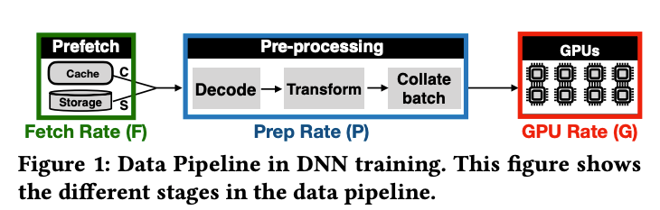

1. 在解决的是什么问题？DNN 训练时，耗时主要在等待数据读取和预处理
2. 为何成功，标志/准是什么？提供了一个工具： DS-Analyzer 来精确衡量 data stalls. 设计并实现了简单但高效的技术，用来做数据加载的库，叫 CoorDL，用来缓解 data stalls
3. 在前人基础上的关键创新是什么？
4. 关键结果有哪些？比起 DALI lib，在单机上快5倍
5. 有哪些局限性？如何优化？
6. 这个工作可能有什么深远的影响？

### 1.1 贡献
区分了几个因素的影响：
1. 存储介质
2. 可以在内存里 cache 的数据量
3. 可以用来fetch 和 预处理数据的 CPU 线程个数
4. GPU gen

缓解 data stalls：

利用操作系统的 LRU 来cache 数据不合适，因为数据用完，在下一个epoch里才会被用到

1. 实现了 MinIO ： 一个软件 cache 专门给 DNN 训练优化用的
2. partitioned caching technique 来在廉价机器上协调 MinIO 的 cache
3. coordinated prep 技术来消除数据准备时的冗余

是基于 DALI 实现了一套用户态的 lib： CoorDL。

data stall 分为这两类，会让 GPU 空闲下来：

1. fetch stall
2. prep stall

F: prefetch data rate

P: pre-process data rate

G: GPU computation rate

G > min(F,P) then data stalls appear

## TODO
1. 2020 Quiver: An Informed Storage Cache for Deep Learning.
2. Operating System Support for Database Management
