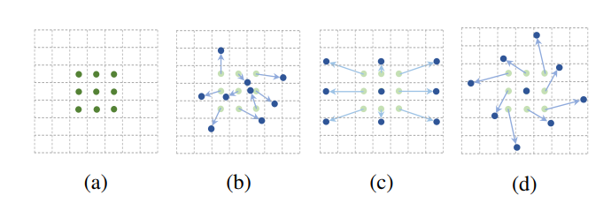
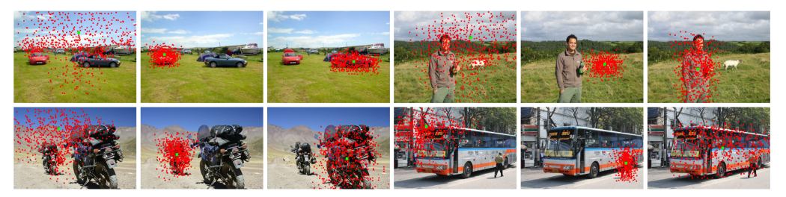

1. 在解决的是什么问题？如何建模大小、形状变换的图形？传统的 CNN 使用的固定的位置、窗口来采样输入的 feature map，pooling layer 也是使用同样的矩形 kernel 来以固定比例减少空间分辨率
2. 为何成功，标志/准是什么？提出了创新的可变卷积，可变 ROI，而且是local，dense，non-parametric 的算法
3. 在前人基础上的关键创新是什么？让卷积的感受野不再固定，而是根据物体大小形状而自适应
4. 关键结果有哪些？在检测、语义分割里涨点，而且增加了少量参数，计算量增加很小
5. 有哪些局限性？如何优化？
6. 这个工作可能有什么深远的影响？

传统卷积操作包含两部：

1. 使用矩形的kernel 采样输入图片或feature map的一个小矩形区域
2. 使用矩形的kernel里的权重来乘以残阳的值，然后加起来，变成一个标量

下图展示了 conv 和 deformable conv 的差异，可以看到它能适应不规则形状、缩放、螺旋

Deformable convolution layers 一般用在 CNN 的最后几层而非前面，因为前面主要是抽取形状，edge 信息，而越往后，越包含 object-level 的语义信息。

下图里看到4张图片，每个里检测背景，前景里小物体，大物体。如果使用平常的卷积，给定图片里所有物体的感受野都是一样的。但是下图是 deformable convolution 的，自适应了目标的大小。
小尺寸的物体比如汽车有小的感受野，与之相比大的公交车感受野更大。而背景物体的感受野跟大，与之相比前景物体的小

偏移是通过额外的卷积层来根据前面的feature map 学习到的。因此应用到输入feature上的变形是 local, dense and adaptive manner
## 问题
1. 论文里提到的 local 是啥意思？dense 是？non-parametric 是说和其他人的方案比，不是需要提前预设的？

参考资料：
1. [Video: Deformable Convolutional Networks in ICCV17](https://www.youtube.com/watch?v=HRLMSrxw2To)
2. [Review: DCN](https://towardsdatascience.com/review-dcn-deformable-convolutional-networks-2nd-runner-up-in-2017-coco-detection-object-14e488efce44)
3. [Deformable Convolutions Demystified](https://towardsdatascience.com/deformable-convolutions-demystified-2a77498699e8)
