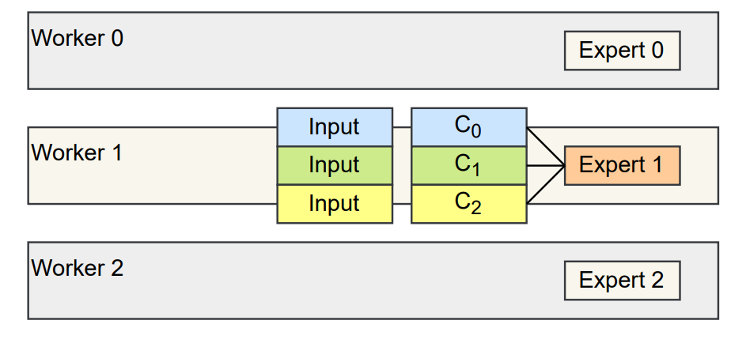

# 1. Smart Scheduling提出的背景

​	在分布式训练中，一般的模型训练分为两种：数据并行和模型并行。	

​	在GShard论文中，针对MoE提出一种专家并行的方法：即将不同的专家(MLP)放置在不同的GPU上，并行操作以加快模型的训练(如下图)。在图中，不同woker将token(训练数据)通过All-to-all操作来传输给期望的专家，在得到输入之后，专家进行计算之后得到结果，再将结果进行All-to-all操作传送回对应的Worker之中，用于作为下一层的输入。


​	在这个过程之中，存在一个问题：集合通信算子效率较低，即要等整个 all-to-all 操作发完所有数据之后才能继续进行操作, 对于计算和通信的硬件资源都有比较大的浪费。

​	从下图我们可以发现，当我们在进行通信操作之时，我们的计算硬件是空闲的，在进行计算操作的时候，通信硬件是空闲的。专家并行之中的all-to-all操作借助于NCCL库中函数进行实现，当我们想对通信和计算这一套粗粒度的流程进行分割之时，由于不同的通信和计算任务存在很强的依赖关系，如果数据传输的顺序设置不当很容易造成死锁。


# 2. Smart Scheduling的优化策略

​	对于Gshard中，集合通信算子效率较低的问题(操作同步执行模型效率低下)。在FasterMoE中引入了异步细粒度智能调度策略(Asynchronous Fine-Grained Smart Scheduling)，将任务划分为更小的部分来进行，并在考虑效率的情况下重新调整细粒度的通信和计算操作。细粒度的通信和计算操作允许异步执行计算和通信操作，从而更好的利用硬件。

​	在优化的过程中，我先首先将worker进行分组来进行all-to-all操作，并使用Pair-wise Exchange算法来执行all-to-all操作。

**Pair-wise Exchange算法**：

​	先将worker分成大小拆分成n组，n个组构成一个环(这里感觉很像Ring All-Reduce算法)，并以从0到n-1的步幅将数据发送给别的组。采用启发式的方法，将紧密联系的worker放在同一组之中，使得在同一组之中的worker联系的更加快速。而组的大小则是由连接拓扑和计算粒度来决定。


​	如上图所示，$W_i$代表了不同的worker，有$n$个worker便对应$n$步，其中第$i$步，$W_i$将token发送到$W_{(j-i)\,mod\,n}$，接受来自$W_{(j+i)\,mod\,n}$的数据。经过$n$轮，每个worker从其他的worker上接受了数据，也将数据发给了其余的worker，这样一次all-to-all操作便被完成。

**粗粒度的划分**：

​	具体的执行过程，参考了作者的Slides：

​	我们将粗粒度的操作划分为三个细粒度的操作，分别为$S,C,R$，下面有一个例子来说明

​	首先，假定我们有三个worker，以worker1为例子：

- $S_i$：Worker $i$ 发送输入给worker1（第一次all-to-all操作的一部分）

  

- $C_i$：在worker1上的expert1对来自worker $i$进行计算



- $R_i$：Worker1将计算得到的output输出给Worker $i$(第二次all-to-all操作的一部分)

​															


**细粒度操作的排列：**

​	在上述过程之中，三个过程之中，每一组三个操作之间有数据依赖关系，而其余的操作没有数据依赖关系，即可以同时执行。

我们可以遵循数据依赖关系，将$C$和$R$尽快的执行，可以得到一个低延迟(这里R1开始在C2执行偏后位置，是因为通信设备被S3操作占用)：

​											

为了进一步最小化延迟，论文中给出了以下解释：

- 使用一组worker来替代一个worker
- 使用启发式的算法，最小化第一个$S$操作和最后一个$R$来进一步降低延迟(实现没太看懂)


# 3. 源码解读

**smart_schedule.h**

```c++
#ifndef SMART_SCHEDULE_H
#define SMART_SCHEDULE_H

#include <cstdio>
#include <iostream>
#include <vector>

#include <cuda.h>
#include <cuda_runtime.h>
#include <nccl.h>

#include "../stream_manager.h"

/*
    借助nccl库对需要all-to-all的信息进行发送和接收
    下面函数都是异步的，即CPU执行后会发射kernel，让GPU去做。然后查询是否做完
*/
template<typename scalar_t>
void exchangeWith(
        const scalar_t* sendbuf, size_t sendcount, int t_send,
        scalar_t* recvbuf, size_t recvcount, int t_recv,
        long d_model,
        cudaStream_t stream, ncclComm_t comm) {
    if (sendcount) {
        // nccl是点对点通信
        ncclSend(sendbuf, sendcount * d_model * sizeof(scalar_t),
                ncclChar, t_send , comm, stream);
    }
    if (recvcount) {
        ncclRecv(recvbuf, recvcount * d_model * sizeof(scalar_t),
                ncclChar, t_recv, comm, stream);
    }
}

/*
 简单的宏定义，用来计算本次S操作需要发送到哪个worker和接收哪个worker的发送(这里的计算仅定位到组)
*/
#define GEN_BASE(_step) \
    long to_base = (group_rank + _step) % n_groups * pipeline_gran; \
    long from_base = (group_rank + n_groups - _step) % n_groups * pipeline_gran;

/*
 简单的宏定义，用来计算需要发送数据的下标
 这里 ei 默认为 0
 idx_send: 本worker发送到哪个worker
 idx_recv: 本worker接收哪个worker的传送

*/
#define GEN_IDX \
    int idx_send = ei + rank_send * num_expert; \
    int idx_recv = ei + rank_recv * num_expert; \
    int gidx_send = ei * world_size + rank_send; \
    int gidx_recv = ei * world_size + rank_recv; \
    int idx_self = ei +      rank * num_expert;

/*
功能：计算local_ptr、global_ptr、local_global_ptr

num_expert: 每个worker的专家数量，一般默认为1
rank: 代表总的worker数量中，本worker为哪一个序号
world_size: 含有专家的woker数量(一般是GPU数量)
local_expert_count: 本worker发出的feature中到每个expert的数量
global_expert_count: 本worker收到的feature中来自每个worker的数量
stored_models: 看模型参数是否存储,影子专家
local_ptr: 本worker发出的feature到每个expert数量的累计和
loacl_global_ptr和global_ptr: 分别是local_expert_count和global_expert_count的前缀和，表示本地的数组里每个其它worker对应的数据的偏移量

*/
void computePtrs(long num_expert, long rank, long world_size,
        const long* local_expert_count,
        const long* global_expert_count,
        const bool* stored_models,
        int *local_ptr,
        int *global_ptr,
        int *local_global_ptr) {
    local_ptr[0] = global_ptr[0] = local_global_ptr[0] = 0;
    // 遍历所有的worker,计算local_ptr,local_global_ptr
    for (int i = 0; i < num_expert * world_size; ++i) {
        local_ptr[i + 1] = local_ptr[i] + local_expert_count[i];

        local_global_ptr[i + 1] = local_global_ptr[i];
        // if model fetched, add local tokens
        if (stored_models[i]){
            local_global_ptr[i + 1] += local_expert_count[i];
        }

        // 计算worker的组号和组中序号
        auto expert_idx = i % num_expert;
        auto worker_idx = i / num_expert;

        // 用来表示全局的坐标
        auto gp_idx = expert_idx * world_size + worker_idx;
        // if local model wasn't fetched, receive global tokens
        if (stored_models[rank * num_expert + expert_idx]) {
            global_ptr[gp_idx + 1] = 0;
        } else {
            global_ptr[gp_idx + 1] = global_expert_count[i];
        }
    }
    global_ptr[0] = 0;
    for (int i = 0; i < num_expert * world_size; ++i) {
        global_ptr[i + 1] += global_ptr[i];
    }
}

/*
    计算模板，根据专家模型的架构利用GPU进行计算，将inp_buf中内容输入专家，进行计算输出到out_buf
*/

template<typename scalar_t>
void computeFn(py::function fn, c10::Device device,
        scalar_t* inp_buf, scalar_t* out_buf,
        long idx, long offset, long micro_batch_size, long d_model,
        CudaStreamManager* smgr) {
    if(micro_batch_size == 0) {
        return;
    }
    auto options = torch::TensorOptions()
        .dtype(c10::CppTypeToScalarType<scalar_t>::value)
        .device(device)
        .requires_grad(true);
    auto inp = torch::from_blob(inp_buf + offset * d_model,
            {micro_batch_size, d_model}, options);
    auto oup = torch::from_blob(out_buf + offset * d_model,
            {micro_batch_size, d_model}, options);
    smgr->use_default = true;
    fn(inp, oup, idx);
    smgr->use_default = false;
}

/*
	利用CUDA的正向计算过程，涉及到S、C、R操作
	其中有rank这是针对一个worker而言的
*/

template<typename scalar_t>
void fmoe_cuda_fused_forward_impl(
        py::function forward_fn,
        py::function stash_fn,
        py::function pop_fn,
        c10::Device device,
        std::vector<torch::Tensor> params,

        scalar_t* input_buf,
        scalar_t* global_input_buf,
        scalar_t* global_output_buf,
        scalar_t* output_buf,

        const long* local_expert_count,
        const long* global_expert_count,
        const bool* stored_models,

        long d_model,
        long num_expert, long rank, long world_size, long expert_size,
        long pipeline_gran, CudaStreamManager* smgr) {
    auto torch_stream = c10::cuda::getCurrentCUDAStream().stream();

    int *local_ptr = new int[num_expert * world_size + 1];
    int *global_ptr = new int[num_expert * world_size + 1];
    int *local_global_ptr = new int[num_expert * world_size + 1]; // local fetched models tracker
    computePtrs(num_expert, rank, world_size,
            local_expert_count, global_expert_count, stored_models,
            local_ptr, global_ptr, local_global_ptr);

    if (pipeline_gran > world_size) {
        pipeline_gran = world_size;
    }
    // n_groups: 分组的个数
    // group_rank: 代表了在第几组
    long n_groups = world_size / pipeline_gran;
    long group_rank = rank / pipeline_gran;

    cudaEvent_t *input_ready = new cudaEvent_t[n_groups];
    cudaEvent_t *output_ready = new cudaEvent_t[n_groups];
    for (long i = 0; i < n_groups; ++i) {
        cudaEventCreate(input_ready + i);
        cudaEventCreate(output_ready + i);
    }
    /*
        这里由前面的group_rank变量，可以定位到本worker在哪个group，然后n个step
    */

    // S_0 ... S_n(本模块是进行S操作，对数据进行发送)
    for (long step = 0; step < n_groups; ++step) {
        for (long ei = 0; ei < num_expert; ++ei) {
            // 宏替换，计算发送到的组和接收哪一组的token
            GEN_BASE(step);

            /*
                nccGroupStart()/End()之间的所有调用视为对许多设备单个调用
            */
            NCCL_SAFE_CALL(ncclGroupStart());
            // 每个组都有pipeline_gran个worker
            for (int j = 0; j < pipeline_gran; ++j) {
                // rank_send: 指定token发送给哪一个worker
                int rank_send = j + to_base;
                // rank_recv: 用来定位本worker接收哪一个worker发来的token
                int rank_recv = j + from_base;

                GEN_IDX;

                /*
                 进行数据的发送，这里虽然通过for循环嵌套来进行n_groups * pipeline_gran次的
                 exchangeWith操作，但是都是用的Ncclcomm这同一个stream，所以通信是串行的。

                */
                exchangeWith(input_buf + local_ptr[idx_send] * d_model,
                        local_expert_count[idx_send] * !stored_models[idx_send], rank_send,
                        global_input_buf + global_ptr[gidx_recv] * d_model,
                        global_expert_count[idx_recv] * !stored_models[idx_self], rank_recv,
                        d_model, smgr->stream(0), smgr->ncclcomm);
            }
            NCCL_SAFE_CALL(ncclGroupEnd());
        }
        cudaEventRecord(input_ready[step], smgr->stream(0));
    }

    // Broadcast shadowed experts(将影子专家进行广播，这是论文中对负载不均衡的改进)
    cudaEvent_t evt_get, *evt_shadow;
    if (params.size() > 0) {
        evt_shadow = new cudaEvent_t[params.size()];
    }
    for (long i = 0, si = 0; i < world_size * num_expert; ++i) {
        if (stored_models[i]) {
            if (i / num_expert == rank) {
                cudaEventCreate(&evt_get);
                cudaEventRecord(evt_get, torch_stream);
                cudaStreamWaitEvent(smgr->stream(1), evt_get);
                cudaEventDestroy(evt_get);
            }
            NCCL_SAFE_CALL(ncclBcast((void*)params[si].data_ptr<scalar_t>(),
                        expert_size * sizeof(scalar_t), ncclChar,
                        i / num_expert, smgr->ncclcomm, smgr->stream(0)));
            cudaEventCreate(evt_shadow + si);
            cudaEventRecord(evt_shadow[si], smgr->stream(0));
            ++si;
        }
    }

    // C_0 ... C_n(各个Experts收到input，进行正向计算)
    // 这里Ci的计算依赖Si,Ci需要等待Si计算完成才能开始
    for (long step = 0; step < n_groups; ++step) {
        cudaStreamWaitEvent(torch_stream, input_ready[step], 0);
        for (int ei = 0; ei < num_expert; ++ei) {
            GEN_BASE(step);
            long offset = global_ptr[ei * world_size + from_base];
            long micro_batch_size = global_ptr[ei * world_size +
                (from_base + pipeline_gran)] - offset;
            computeFn(forward_fn, device,
                    global_input_buf, global_output_buf,
                    step, offset, micro_batch_size, d_model, smgr);
        }
        cudaEventRecord(output_ready[step], torch_stream);
    }

    // Compute over shadowed experts(对负载不均衡情况，利用影子专家进行计算)
    for (long i = 0, si = 0; i < world_size * num_expert; ++i) {
        if (stored_models[i]) {
            stash_fn(params[si], si);
            cudaStreamWaitEvent(torch_stream, evt_shadow[si], 0);
            long offset = local_ptr[i];
            long micro_batch_size = local_expert_count[i];
            computeFn(forward_fn, device,
                    input_buf, output_buf,
                    n_groups + si, offset, micro_batch_size, d_model, smgr);
            ++si;
        }
    }
    pop_fn();

    // R_0 ... R_n (对计算的结果再进行一次all-to-all操作，将输入的token进行计算后，传播到后面)
    // Ri操作需要在Ci操作之后
    for (long step = 0; step < n_groups; ++step) {
        cudaStreamWaitEvent(smgr->stream(0), output_ready[step], 0);
        for (int ei = 0; ei < num_expert; ++ei) {
            GEN_BASE(step);
            NCCL_SAFE_CALL(ncclGroupStart());
            for (int j = 0; j < pipeline_gran; ++j) {
                int rank_send = j + from_base;
                int rank_recv = j + to_base;
                GEN_IDX;
                exchangeWith(global_output_buf + global_ptr[gidx_send] * d_model,
                        global_expert_count[idx_send] * !stored_models[idx_self], rank_send,
                        output_buf + local_ptr[idx_recv] * d_model,
                        local_expert_count[idx_recv] * !stored_models[idx_recv], rank_recv,
                        d_model, smgr->stream(0), smgr->ncclcomm);
            }
            NCCL_SAFE_CALL(ncclGroupEnd());
        }
    }

    delete [] local_ptr;
    delete [] global_ptr;
    delete [] local_global_ptr;
    checkCudaErrors(cudaGetLastError());
    for (long i = 0; i < n_groups; ++i) {
        cudaEventDestroy(input_ready[i]);
        cudaEventDestroy(output_ready[i]);
    }
    for (unsigned i = 0; i < params.size(); ++i) {
        cudaEventDestroy(evt_shadow[i]);
    }
    delete [] input_ready;
    delete [] output_ready;
}


/*
    进行反向传播，将传输的数据变成了梯度，方便进行更新
*/

template<typename scalar_t>
void fmoe_cuda_fused_backward_impl(
        py::function backward_fn,
        py::function stash_fn,
        py::function pop_fn,
        py::function collect_fn,
        py::function set_grad_fn,
        c10::Device device,

        scalar_t* grad_out,
        scalar_t* global_grad_out,
        scalar_t* global_grad_in,
        scalar_t* grad_in,

        const long* local_expert_count,
        const long* global_expert_count,
        const bool* stored_models,
        long d_model,
        long num_expert, long rank, long world_size,
        long pipeline_gran, CudaStreamManager* smgr) {
    auto torch_stream = c10::cuda::getCurrentCUDAStream().stream();

    int *local_ptr = new int[num_expert * world_size + 1];
    int *global_ptr = new int[num_expert * world_size + 1];
    int *local_global_ptr = new int[num_expert * world_size + 1]; // local fetched models tracker

    computePtrs(num_expert, rank, world_size,
            local_expert_count, global_expert_count, stored_models,
            local_ptr, global_ptr, local_global_ptr);
    if (pipeline_gran > world_size) {
        pipeline_gran = world_size;
    }
    long n_groups = world_size / pipeline_gran;
    long group_rank = rank / pipeline_gran;

    cudaEvent_t *input_ready = new cudaEvent_t[n_groups];
    cudaEvent_t *output_ready = new cudaEvent_t[n_groups];
    for (long i = 0; i < n_groups; ++i) {
        cudaEventCreate(input_ready + i);
        cudaEventCreate(output_ready + i);
    }

    // S_0 ... S_n
    for (long step = 0; step < n_groups; ++step) {
        for (int ei = 0; ei < num_expert; ++ei) {
            GEN_BASE(step);
            NCCL_SAFE_CALL(ncclGroupStart());
            for (int j = 0; j < pipeline_gran; ++j) {
                int rank_send = j + to_base;
                int rank_recv = j + from_base;
                GEN_IDX;

                // 发送的数据有input变为梯度
                exchangeWith(grad_out + local_ptr[idx_send] * d_model,
                        local_expert_count[idx_send] * !stored_models[idx_send], rank_send,
                        global_grad_out + global_ptr[gidx_recv] * d_model,
                        global_expert_count[idx_recv] * !stored_models[idx_self], rank_recv,
                        d_model, smgr->stream(0), smgr->ncclcomm);
            }
            NCCL_SAFE_CALL(ncclGroupEnd());
        }
        cudaEventRecord(input_ready[step], smgr->stream(0));
    }

    // Shadowed experts backward and reduce(影子专家参数进行更新)
    cudaEvent_t *evt_reduce = new cudaEvent_t[num_expert];
    for (long i = 0, si = 0; i < world_size * num_expert; ++i) {
        if (stored_models[i]) {
            stash_fn(si);
            long offset = local_ptr[i];
            long micro_batch_size = local_expert_count[i];
            computeFn(backward_fn, device,
                    grad_out, grad_in,
                    n_groups + si, offset, micro_batch_size, d_model, smgr);
            collect_fn(si, i / num_expert);
            if (i / num_expert == rank) {
                cudaEventCreate(evt_reduce + i % num_expert);
                cudaEventRecord(evt_reduce[i % num_expert], smgr->stream(0));
            }
            ++si;
        }
    }
    pop_fn();

    // C_0 ... C_n
    for (long step = 0; step < n_groups; ++step) {
        cudaStreamWaitEvent(smgr->stream(1), input_ready[step], 0);
        for (int ei = 0; ei < num_expert; ++ei) {
            GEN_BASE(step);
            long offset = global_ptr[ei * world_size + from_base];
            long micro_batch_size = global_ptr[ei * world_size +
                (from_base + pipeline_gran)] - offset;

            computeFn(backward_fn, device,
                    global_grad_out, global_grad_in,
                    step, offset, micro_batch_size, d_model, smgr);
        }
        cudaEventRecord(output_ready[step], torch_stream);
    }

    // Collect gradients for shadowed experts(从影子专家收集梯度)
    for (long i = 0, si = 0; i < world_size * num_expert; ++i) {
        if (stored_models[i]) {
            if (i / num_expert == rank) {
                cudaStreamWaitEvent(torch_stream, evt_reduce[i % num_expert], 0);
                set_grad_fn(si);
            }
            ++si;
        }
    }

    // R_0 ... R_n
    for (long step = 0; step < n_groups; ++step) {
        cudaStreamWaitEvent(smgr->stream(0), output_ready[step], 0);
        for (int ei = 0; ei < num_expert; ++ei) {
            GEN_BASE(step);
            NCCL_SAFE_CALL(ncclGroupStart());
            for (int j = 0; j < pipeline_gran; ++j) {
                int rank_send = j + from_base;
                int rank_recv = j + to_base;
                GEN_IDX;
                exchangeWith(global_grad_in + global_ptr[gidx_send] * d_model,
                        global_expert_count[idx_send] * !stored_models[idx_self], rank_send,
                        grad_in + local_ptr[idx_recv] * d_model,
                        local_expert_count[idx_recv] * !stored_models[idx_recv], rank_recv,
                        d_model, smgr->stream(0), smgr->ncclcomm);
            }
            NCCL_SAFE_CALL(ncclGroupEnd());
        }
    }

    checkCudaErrors(cudaGetLastError());

    delete [] local_ptr;
    delete [] global_ptr;
    delete [] local_global_ptr;
    checkCudaErrors(cudaGetLastError());
    for (long i = 0; i < n_groups; ++i) {
        cudaEventDestroy(input_ready[i]);
        cudaEventDestroy(output_ready[i]);
    }
    delete [] input_ready;
    delete [] output_ready;
    for (long i = 0; i < num_expert; ++i) {
        if (stored_models[i + rank * num_expert]) {
            cudaEventDestroy(evt_reduce[i]);
        }
    }
    delete [] evt_reduce;
}

#endif  // SMART_SCHEDULE_H

```

**smart_schedule.cpp**

```c++
#ifdef FMOE_USE_NCCL

#include <cstdlib>
#include <vector>
#include <torch/extension.h>
#include <c10/cuda/CUDAGuard.h>

#include "smart_schedule.h"
#include "status.h"

// 组的大小
long pipeline_gran = -1;

int smart_sch_enabled = 0;

int isSmartSchEnabled() {
    return smart_sch_enabled;
}
void setSmartSchEnabled(int s) {
    smart_sch_enabled = s;
}

// 数据种类判断
inline ncclDataType_t getNcclDataType(at::ScalarType t) {
    switch (t) {
        case at::kChar: return ncclInt8;
        case at::kByte: return ncclUint8;
        case at::kFloat: return ncclFloat;
        case at::kDouble: return ncclDouble;
        case at::kInt: return ncclInt32;
        case at::kLong: return ncclInt64;
        case at::kHalf: return ncclHalf;
        case at::kBool: return ncclUint8;
#if defined(ENABLE_NCCL_BF16_DATATYPE)
        case at::kBFloat16: return ncclBfloat16;
#endif
        default: return ncclChar;
    }
}

// 对梯度进行reduce操作
void _reduce_grad(
        torch::Tensor t,
        long root,
        long expert_size) {
    auto smgr = getCudaStreamManager(t.device().index());

    auto torch_stream = c10::cuda::getCurrentCUDAStream().stream();Collect gradients for shadowed experts
    cudaEvent_t evt_stash;
    cudaEventCreate(&evt_stash);
    cudaEventRecord(evt_stash, torch_stream);
    cudaStreamWaitEvent(smgr->stream(0), evt_stash, 0);
    cudaEventDestroy(evt_stash);

    auto dtype = getNcclDataType(t.scalar_type());
    /*
     这个宏应该是为了支持float16
     第一个参数是指定type
     第二个参数是这个操作的名字
     第三个参数是一个lambda函数：
     nllcReduce: ncclResult_t ncclReduce(const void* sendbuff,
     void* recvbuff, size_t count(length),
     ncclDataType_t datatype, ncclRedOp_t op,
     int root, ncclComm_t comm, cudaStream_t stream)
     对梯度进行sum发送到recvbuff
    */
    AT_DISPATCH_FLOATING_TYPES_AND_HALF(t.scalar_type(),
        "fmoe_cuda_reduce_grad", ([&] {
            void* buf = (void*)t.data_ptr<scalar_t>();
            NCCL_SAFE_CALL(ncclReduce(buf, buf, expert_size,
                        dtype,
                        ncclSum, root,
                        smgr->ncclcomm, smgr->stream(0)));
        })
    );
}

/*
    调用smart_schedule.h中的fmoe_cuda_fused_forward_impl接口，完成正向计算
*/

std::vector<torch::Tensor> _smart_sch_forward(
        torch::Tensor input_buf,
        torch::Tensor local_expert_count,
        torch::Tensor global_expert_count,
        torch::Tensor stored_models,
        long global_batch_size,
        long expert_size,
        long n_workers,
        py::function forward_fn,
        py::function get_param_fn,
        py::function stash_fn,
        py::function pop_fn) {
    // 对pipeline_gran进行初始化
    if (pipeline_gran == -1) {
        // 环境变量中FMOE_FASTER_GROUP_SIZE用来调节Group-wise exchange的group的大小
        char* p = getenv("FMOE_FASTER_GROUP_SIZE");
        if (p) {
            pipeline_gran = atoi(p);
        } else {
            pipeline_gran = 4;
        }
        setSmartSchEnabled(1);
    }

    auto smgr = getCudaStreamManager(input_buf.device().index());
    int rank;
    // 返回nccl通信器的等级
    NCCL_SAFE_CALL(ncclCommUserRank(smgr->ncclcomm, &rank));

    const auto num_expert = local_expert_count.size(0) / n_workers;
    // d_model: 模型输入的维度
    const auto d_model = input_buf.size(1);

    // TODO: maybe empty is faster
    // global_input_buf: 本worker接收别的worker发出feature的缓冲
    // global_output_buf: 本worker计算(从别的worker接收的数据)后输出data的缓冲
    auto global_input_buf = input_buf.new_zeros({global_batch_size, d_model});
    auto global_output_buf = input_buf.new_zeros({global_batch_size, d_model});
    auto output_buf = input_buf.new_zeros({input_buf.size(0), d_model});

    std::vector<torch::Tensor> params;
    auto stored_models_ = stored_models.data_ptr<bool>();
    for (long i = 0; i < num_expert * n_workers; ++i) {
        if (stored_models_[i]) {
            torch::Tensor t = input_buf.new_empty({expert_size});
            if (i / num_expert == rank) {
                get_param_fn(t);
            }
            params.push_back(t);
        }
    }

    AT_DISPATCH_FLOATING_TYPES_AND_HALF(input_buf.scalar_type(),
            "fmoe_cuda_smart_sch_forward", ([&] {
        fmoe_cuda_fused_forward_impl(
            forward_fn,
            stash_fn,
            pop_fn,
            input_buf.device(),
            params,

            input_buf.data_ptr<scalar_t>(),
            global_input_buf.data_ptr<scalar_t>(),
            global_output_buf.data_ptr<scalar_t>(),
            output_buf.data_ptr<scalar_t>(),

            local_expert_count.data_ptr<long>(),
            global_expert_count.data_ptr<long>(),
            stored_models.data_ptr<bool>(),
            d_model, num_expert, rank, n_workers, expert_size,
            pipeline_gran, smgr);
    }));
    return {output_buf, global_input_buf};
}

/*
    调用smart_schedule.h中的fmoe_cuda_smartsch_backward接口，完成反向传播过程对梯度进行计算
*/


torch::Tensor _smart_sch_backward(
        torch::Tensor grad_out,
        torch::Tensor local_expert_count,
        torch::Tensor global_expert_count,
        torch::Tensor stored_models,
        long buf_batch_size,
        long global_batch_size,
        long n_workers,
        py::function backward_fn,
        py::function stash_fn,
        py::function pop_fn,
        py::function collect_fn,
        py::function set_grad_fn) {
    const auto num_expert = local_expert_count.size(0) / n_workers;
    auto smgr = getCudaStreamManager(grad_out.device().index());
    int rank;
    ncclCommUserRank(smgr->ncclcomm, &rank);
    const auto d_model = grad_out.size(1);
    auto global_grad_out = grad_out.new_zeros({global_batch_size, d_model});
    auto global_grad_in = grad_out.new_zeros({global_batch_size, d_model});
    auto grad_in = grad_out.new_zeros({buf_batch_size, d_model});

    AT_DISPATCH_FLOATING_TYPES_AND_HALF(grad_out.scalar_type(),
            "fmoe_cuda_smartsch_backward", ([&] {
        fmoe_cuda_fused_backward_impl(
            backward_fn,
            stash_fn,
            pop_fn,
            collect_fn,
            set_grad_fn,
            grad_out.device(),

            grad_out.data_ptr<scalar_t>(),
            global_grad_out.data_ptr<scalar_t>(),
            global_grad_in.data_ptr<scalar_t>(),
            grad_in.data_ptr<scalar_t>(),

            local_expert_count.data_ptr<long>(),
            global_expert_count.data_ptr<long>(),
            stored_models.data_ptr<bool>(),
            d_model, num_expert, rank, n_workers,
            pipeline_gran, smgr);
    }));
    return grad_in;
}
#endif


```

**schedule.py**

```python
r"""
The smart schedule proposed in FasterMoE.
"""
import torch
from torch.autograd.function import Function

from fmoe.functions import prepare_forward, ensure_comm
from fmoe.functions import _local_scatter, _local_gather 
import fmoe_cuda as fmoe_native
from fmoe.fastermoe import expert_utils

from .shadow_policy import get_shadow_policy

# 自定义一个Function，这个可以帮助我们构建计算图，计算图中有各种各样的Variable，而Function就是对其中的Variable进行计算
class MoEForward(Function):
    @staticmethod
    def forward(
            ctx,
            expert_fn,
            experts,
            inp, # models,
            pos_s, pos_g,
            local_expert_count, global_expert_count,
            stored_models,
            fwd_batch_size, out_batch_size,
            world_size):
        """

        Args:
        expert_fn:  The default expert function which either calls the experts as a whole
        or as separate experts.
        experts: 专家模型
        inp: input 输入的数据

        local_expert_count: 本worker发出的feature中到每个expert的数量
        global_expert_count: 本worker收到的
        stored_models: bool类型的指针，看模型参数是否存储,影子专家
        fwd_batch_size： forward_batch_size
        out_batch_size: output的batch size大小
        world_size: 含有专家的woker数量(一般是GPU数量)

        """
        # scatter操作表示一种散播行为，其中的_local_scatter,是返回一个input_buf(),即通过inp(为tensor),挑选维度为0
        # 依据pos_s取出本worker输入数据
        local_input_buf = _local_scatter(inp, pos_s)

        # 开一个长度为 2 * world_size的List
        # ctx.gibs: 根据下标idx保存x
        # ctx.gobs: 保存专家模型的输出
        ctx.gibs = [None] * (world_size * 2)
        ctx.gobs = [None] * (world_size * 2)

        # 这里定义专家的forward
        def _expert_forward(x, y, idx):
            # 匿名函数
            nothing = lambda a: a
            # x 可能是输入的数据
            x = x.data
            # 允许计算梯度
            with torch.enable_grad():
                # 表示x可以参与求导，也可以从它向后求导
                x.requires_grad = True
                try:
                    # To skip torch autograd's version check.
                    with torch.autograd.graph.saved_tensors_hooks(nothing, nothing):
                        y0 = expert_fn(x, torch.tensor([x.shape[0]], dtype=torch.int64))
                except Exception as e:
                    # Ignore the error and fall back for compatibility to older
                    # versions of PyTorch
                    y0 = expert_fn(x, torch.tensor([x.shape[0]], dtype=torch.int64))
            ctx.gibs[idx] = x
            ctx.gobs[idx] = y0
            y.copy_(y0)

        ctx.experts = experts

        # 看是否已经保存的模型，得到模型的参数
        if stored_models.any():
            ctx.expert_size = expert_utils.get_expert_param_size(experts)
        else:
            ctx.expert_size = 0

        # 将专家的参数写入out
        get_param_fn = lambda out: expert_utils.get_expert_params(experts, out)
        # 将专家的参数专家的参数替换为stash中的参数
        pop_fn = lambda: expert_utils.pop_expert_params(experts)

        # 影子专家
        ctx.shadows = [None] * world_size

        # 将原参数进行保存，并接收影子专家的参数
        def stash_fn(params, idx):
            # 隐藏专家的参数
            expert_utils.stash_expert_params(experts, params)
            # 将影子专家的参数值指定为广播到的params
            ctx.shadows[idx] = params

        # 调用smart_schedule.h中的fmoe_cuda_fused_forward_impl接口，完成正向计算
        # 返回output_buf 和global_input_buf
        local_output_buf, gib = fmoe_native.smart_sch_forward(
                local_input_buf,
                local_expert_count, global_expert_count, 
                stored_models, fwd_batch_size, ctx.expert_size,
                world_size, _expert_forward, get_param_fn, stash_fn, pop_fn)

        # 计算需要发送出去的output
        # 使用pos_g进行定位
        out = _local_gather(local_output_buf, pos_g, out_batch_size,
                maybe_overlap=False)
        
        # gib and local_input_buf are necessary, because ctx.gibs are created
        # based on their memory
        variables = (pos_s, pos_g, local_expert_count, global_expert_count,
                stored_models, gib, local_input_buf)
        
        ctx.moe_args = fwd_batch_size, inp.shape[0], world_size
        # 保存给定的variables，以便反向传播
        ctx.save_for_backward(*variables)

        return out

    @staticmethod
    def backward(ctx, grad_out):
        (pos_s, pos_g, local_expert_count, global_expert_count,
                stored_models, _1, _2) = ctx.saved_tensors
        (fwd_batch_size, inp_batch_size, world_size) = ctx.moe_args

        # 反向传播计算，计算x的梯度
        def _expert_backward(grad_y, grad_x, idx):
            y = ctx.gobs[idx]
            x = ctx.gibs[idx]
            torch.autograd.backward([y], [grad_y])
            grad_x.copy_(x.grad)

        experts = ctx.experts

        # 保存专家参数
        def stash_fn(idx):
            expert_utils.stash_expert_params(experts, ctx.shadows[idx])

        # 将参数替换成stash参数，并将stash参数删除
        pop_fn = lambda: expert_utils.pop_expert_params(experts)

        # 对梯度进行reduce操作(影子专家将计算分散到不同的worker上去了)
        def collect_fn(idx, root):
            grad = ctx.shadows[idx]
            expert_utils.collect_expert_grads(experts, grad)
            fmoe_native.reduce_grad(grad, root, ctx.expert_size)

        # 梯度设置
        set_grad_fn = lambda idx: expert_utils.set_grads(experts, ctx.shadows[idx])

        # 根据输出的位置计算梯度输出的buf
        grad_out_buf = _local_scatter(grad_out.contiguous(), pos_g)

        # 调用smart_schedule.h中的fmoe_cuda_smartsch_backward接口，完成反向传播过程对梯度进行计算
        grad_in_buf = fmoe_native.smart_sch_backward(
                grad_out_buf,
                local_expert_count, global_expert_count,
                stored_models,
                pos_s.shape[0], fwd_batch_size,
                world_size,
                _expert_backward, stash_fn, pop_fn, collect_fn, set_grad_fn)
        # 将不同的梯度输入buffer进行聚集，得到输入的梯度
        grad_in = _local_gather(grad_in_buf, pos_s, inp_batch_size)

        return (None, None, grad_in, None, None, None, None, None, None, None, None)


policy_fn = None

# moe的正向计算
def _fmoe_general_global_forward(inp, gate, expert_fn, n_expert, world_size, experts=None, stored_models=None):
    # TODO: Using multiple tensors as input is to be supported.
    # 检查inp是否是tensor数据类型，非tensor抛出异常
    assert(isinstance(inp, torch.Tensor))
    # TODO: Support many experts on each process
    # 检查n_expert == 1，专家的输入和输出的向量长度必须相等
    assert(n_expert == 1)
    (
        pos,
        local_expert_count,
        global_expert_count,
        fwd_expert_count,
        fwd_batch_size,
    ) = prepare_forward(gate, n_expert, world_size)
    # Prepare necessary information from gate output for MoE computation.
    # n_expert: number of experts on each worker.
    # world_size: 拥有专家的GPU数目


    global policy_fn
    # 政策函数，调用get_shadow_policy看是否调用影子专家
    if policy_fn is None:
        policy_fn = get_shadow_policy(d_model=inp.shape[-1])
    # 查看模型是否被存储，如果没被存储调用政策函数
    if stored_models is None:
        stored_models = policy_fn(local_expert_count, global_expert_count,
                n_expert, world_size)

    topk = 1
    # 设定选定的专家数目
    if len(gate.shape) == 2:
        topk = gate.shape[1]
    out_batch_size = inp.shape[0] * topk

    return MoEForward.apply(expert_fn, experts, inp,
            torch.div(pos, topk, rounding_mode='floor'), pos,
            local_expert_count, global_expert_count, stored_models,
            fwd_batch_size, out_batch_size, world_size)

```


# 4. 有关疑问点(补充说明)

**说明**：

- num_expert必须设为1

- 专家的输入和输出的向量长度必须相等

- ncclGroupStart时，不需要指定有哪些人参与到这个group里？难道默认是所有人都在
  - fmoe_cuda_fused_forward_impl中有一个参数rank，相当于一个全局的坐标编号，能从中推算出所在的group，因为是采用分组，每一组的worker个数是pipeline_gran，所有在ncclGroupStart时，下面的循环就代表了一个组数据发送，其中每个worker都有一个专家，而专家的输入，是所有woker进行传播然后通过gate进行选择，具体哪个worker传过来的数据需要进行计算。
- 为什么是step粒度的记录，而非更细粒度ei粒度的
  - 粒度的划分是这样的：以前S,C,R操作都是串行的，比如S1,C1,R1然后再S2,C2,R1这种串行，现在将S,C,R操作给切分了，这时候为了最小化延迟将woker分组，是以组进行通信交流的，这个Record是写在有关S,C的循环里的。
- 这里的ei没明白是啥意思？当前代码是在k这个人上执行的，那它需要与其他人进行通信，所以ei就是其他人的意思。每次exchange都是说(k, ei) 进行通信
  - 作者对于num_expert的解释为：`num_expert` stands for the number of experts on **each** worker.在说明中指定了fastermoe中num_expert必需设为1(作者说功能还没完善，所以源码这里默认都为1)，这里是不是作者留的一个扩展，方便后面更改
