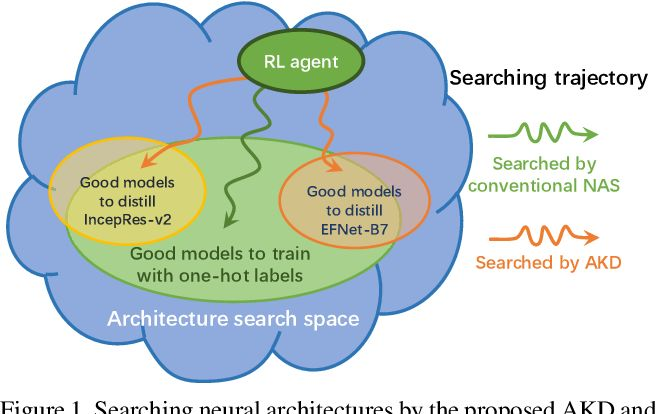

1. 在解决的是什么问题？模型的知识除了参数之外还有结构，但是之前的KD都没有考虑网络结构
2. 为何成功，标志/准是什么？发现不同老师(Eyes)下，好的学生(Pearls)的网络结构各不相同
3. 在前人基础上的关键创新是什么？在知识蒸馏中引入网络结构搜索，而非让学生使用固定的网络结构：提出的 Architecture-aware Knowledge Dissstillation (AKD)
4. 关键结果有哪些？发现KD+NAS 搞出的分类模型，1. 能找出指定老师下表现最好的学生，这个性能很好 2.在万亿规模的人脸识别里也很有用。提出的 AKD 比传统的 NAS + KD 要好
5. 有哪些局限性？如何优化？并没有提出一种衡量网络结构之间相似性的方法
6. 这个工作可能有什么深远的影响？

## KD
### 2. 神经网络中的知识
#### 2.1 到底神经网络中的知识是什么？
Network's **output distribution** conditioned on its input, depends not only on its parameters but also on its architecture: p(y|x)

How and why KD improves neural network training ?
#### 2.2 幼稚的蒸馏

#### 2.3 老师-学生间的关系
想回答一个问题：是否所有学生都有能力接收从不同老师传递的信息？
通过实验发现并不是，同一个学生在不同老师下有好有坏

结论：如果预先定义并固定了学生的结构，有可能让学生牺牲自己的参数来学习老师的架构，导致最终得到的并非最优解。

 
## 3. Architecture-aware Knowledge Distillation
架构图：

从上图看出来传统 NAS 和 AKD 的搜索空间不同

1. RL agent 去搜索网络结构
2. search space 来 sampling student architectures
3. 训练环境来获取 KD-guided reward

## 启发
1. 以往的蒸馏都是固定了学生/小模型的结构。它们提出不同老师在相同任务下的好学生应该不同。为此设计了实验，采用随机出来的不同学生在几个老师下蒸馏，发现确实表现不一，并没有某个学生在每个老师下都很优秀

## 问题
1. differentiable search 是？
2. 4 里通过实验说明网络结构知识并不存在于神经网络？

## TODO
1. 看 Hinton 的知识蒸馏开山之作, 提到的 dark knowledge distillation: Distilling the knowledge in a neural network.
2. 分类里的 OneHot label 是个啥东西？
