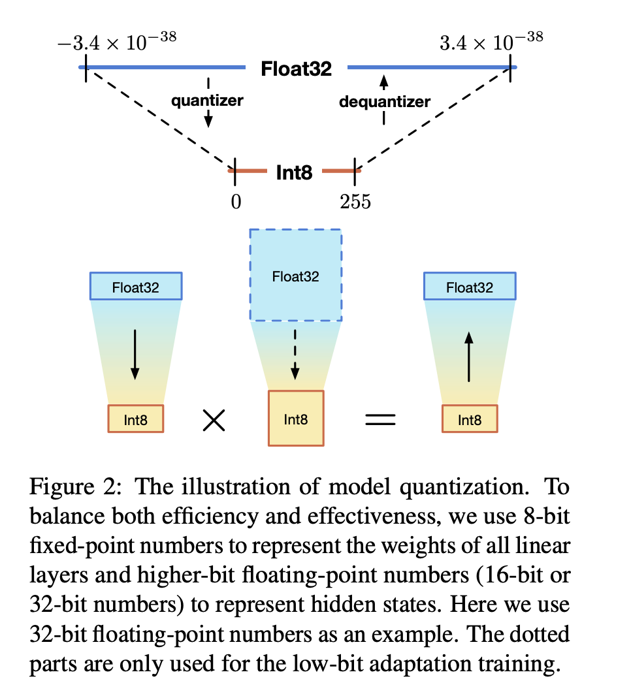

1. 在解决的是什么问题？真实场景下部署大模型遇到的算力瓶颈，搞了这个 BMInf，主要是大模型推理和调优(tuning)
2. 为何成功，标志/准是什么？
3. 在前人基础上的关键创新是什么？ a.算法：模型量化和高效模型推理和调优里的参数高效调优(parameter-efficient tuning for efficient model inference and tuning). b. 实现层面：使用 cpu offloading, activation checkpoint 和 CPU-GPU优化调度
4. 关键结果有哪些？
5. 有哪些局限性？如何优化？
6. 这个工作可能有什么深远的影响？

## 1 简介
一些最近的高效参数调优方法(Hu 2021， Ding et al. 2022)已经达到了和finetuning 所有模型权重一样的结果。我们提供了一个统一接口，来冻结大模型里所有权重，
只给额外的模型计算梯度，这样来支持大模型处理具体的不同任务，不同的高效参数的调优方法

实现层面，用了模型cpu offload 和 checkpointing，可以使用 CPU 显存来存储大模型的参数。而且，模型 offloading 和 checkpoint 可以 丢弃掉forward和backward过程中的一些参数和计算图，可以更多节省显存。重新实现了混合精度的 cuda 算术 op，这样能更好利用GPU 上的 tensor cores，进一步提高计算的速度，尤其是**加速模型量化过程中的混合精度运算**。 由于 模型 offload 带来了额外的 CPU-GPU 通信，所以用了 CPU-GPU 调度优化来同步执行weight加载和模型计算。

对于 Transformer 类型的 PLM，Zafrir 证明了 8-bit 量化对于模型性能影响非常小。为了缓解性能损失，Shen 使用混合比特量化，只对这些 low Hesian spectrum 的参数(梯度变化不大的层？)进行量化。

1-bit 和 2-bit Transformer 对性能影响特别大，所以本工具只量化模型(16 or 32)到8 bit 定点(fixed point)。低比特量化跟硬件高度相关，复杂的量化算法只适合某些硬件。因此如图2，我们会使用简单、高效的混合bit量化算法：只把所有 Linear 层(只涉及 MLP，不涉及 Multihead Attention) 量化。为了让量化对模型影响更小，我们使用少量的预训练数据来做额外的低比特适配训练。在这个低比特训练阶段，我们会使用高比特数值来表示模型权重，但是在计算时会量化为低比特。当低比特适配结束后，高比特权重被丢弃，对应的低比特权重会被用来做推理和调优。

代码[在这](https://github.com/OpenBMB/BMInf/blob/master/bminf/layers/linear.py#L26-L50)：

## 3 减少计算和显存开销的实现
### 3.1 Offloading and checkpointing
model offloading是把权重放到 CPU 上，当模型需要逐层计算时，把权重从 CPU 上搬移到 GPU 里。当计算完成后，释放掉加载的权重和计算图，节省GPU资源。这个可以直接用在推理里，来节省显存空间。但是在训练时，就不能释放掉权重和计算图了。定多是用 checkpoint 来再次计算一遍计算图，以便能backward求梯度。

## 问题：
1. 里面的 tunning 指？ finetune，指模型已经预训练好了，现在需要在下游具体场景上 finetune 一下
2. 问题：只处理了 linear，不处理 gemm？或者说 gemm 已经有现成的？
3. low bit adaption 为啥能缓解掉精度？它是不是需要对应的 optimizer？不需要，因为并不是fp16的计算。它只变换了某个op里的计算过程，对于模型而言可以不感知到用了量化
4. 计算图本身并不大吧，因为里面就是每个tensor会有一个 grad_fn函数和 grad，大的是里面的梯度，跟参数一样大，而只是用一次
