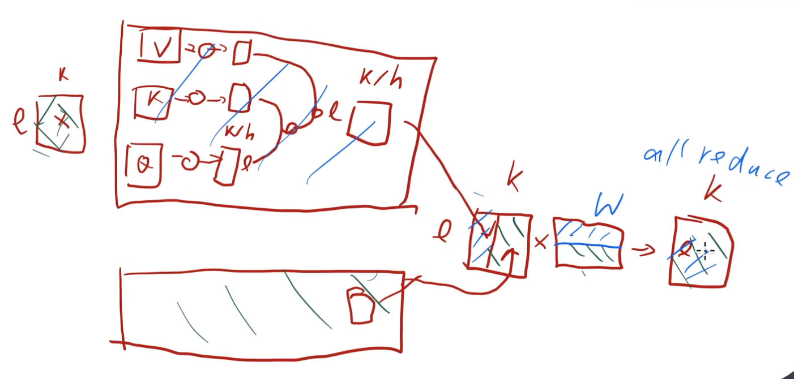
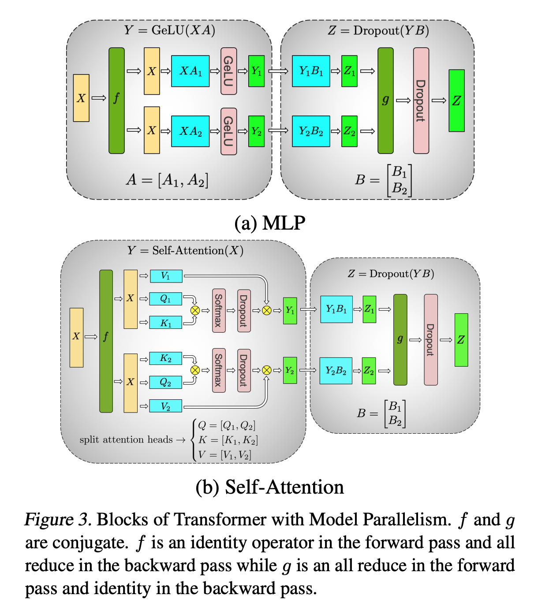
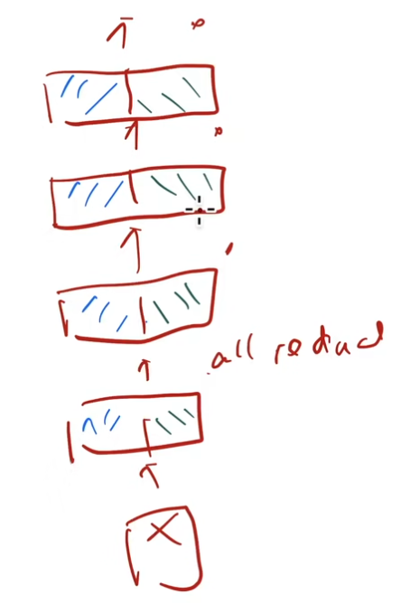

1. 在解决的是什么问题？模型变大后，显存不够的问题
2. 为何成功，标志/准是什么？不需要依赖编译器，不需要重新改写模型
3. 在前人基础上的关键创新是什么？使用纯pytorch来实现了简单的模型并行，与pipeline 并行是正交的
4. 关键结果有哪些？
5. 有哪些局限性？如何优化？
6. 这个工作可能有什么深远的影响？

## 1. 摘要

贡献在以下几方面：

* 实现了简单、高效的模型并行方法，只需要在已有的 PyTorch transformer 实现里修改几个地方
* 深入的分析了模型在数据并行和模型并行模式下，采用512个GPU后，能最大到76%的扩展效率（单机上是硬件峰值 TFLOPS 的 30%: 39TFlops)
* BERT 这类的模型里，layer norm的放置位置对于模型增大时精度变化至关重要
* 增大模型的大小，会让 GPT-2(8.3B)和 BERT（3.9B) 模型的结果精度都提高
* 我们的模型在测试集上 SOTA
* 开源在了 github.com/NVIDIA/Megatron-LM

## MLP 的拆分
假设 X 是输入，那 MLP 的输入是:
b 批量大小，s or l 序列大小，k：隐藏层的大小，一般是一万以内的值，而 v 是词表的大小，一般是几万。n 是 transformer 的层数

运算过程：`Y=GeLU(X*A)*B`，而 GeLU 是逐元素计算激活值的过程。而 A 的纬度是（k,k')，一般 k' 是 k 的4倍。B的大小是(k', k)。

所以看到有两次矩阵乘积，对此拆分即可：

MLP 里第一次是:对A进行行拆分，这样输入 X 必须得复制一份，对 A 列分块的 GPU 上都得有，相比对 A 行拆分，对 X 列拆分，不用额外多一次通信。而此时每个 GPU 上得到各自的那列结果。正好 k' 是 k 的四倍，那么正好 A 和 B 的切分都是按照更大的那个纬来切分的。

第二次就是列(中间隐藏层的大小k)拆分了，因为输入已经是上面第一次拆分后计算得到的分列的结果。此时计算的结果是大小跟Y一样，但结果不完整的，所以得把多块 GPU 上的结果加起来才行(此时通过 allreduce 就可以让每个 gpu 上的输出是一样的/有重复)。

每块在 fwd 时只需要一次通信（第二次拆分完之后需要求和出结果），每个 GPU 上，只有 MLP 的输入和输出上是有重复的，但中间的权重 A 和 B 以及中间结果/激活值是只有 1/tp 的。这样假设中间结果的显存占用是瓶颈，那么可以利用加更多 GPU 进来可以显著降低 A 和 B 以及中间结果的显存值占用。

## 注意力部分的拆分
而注意力部分是按照头来拆分到不同 GPU 上计算的。自注意力机制里，天然就是多头粒度并行的：Q、K、V 都是列并行的方式，这样在自注意力机制里，都是各自 GPU 上计算的，无须通信。只有后面接着的一个 GEMM 操作时，才跟上面 MLP 的第二次 GEMM 操作一样，拿到的都是不完整的结果，需要相加之后再计算 dropout

所以通过上面两个部分的 tp 拆分，可以看到 fwd 过程中需要两次通信（allreduce 列切分矩阵后的不完整结果），而通信量就是最后结果的纬度，即 `b*s*k`

## embedding输入层和输出层的切分
这里切分主要是节省显存了， embedding 的纬度比较大。计算量是节省不了的

他俩都是embedding，而且输出 embed 层和输入层共享 embedding，所以里面的纬度 v 其实是同一个，所以切法得一样。而为了减少 outputlayer 里的通信，我们不通信 `b*s*v` 的大小，而是先计算完 cross entropy loss，纬度减少到 `b*s` 。此时通信的是标量 loss(纬度是  1) 而非是 logits。

从完整的 Fig 4 可以看到在一个 transformer layer 里，只有 Layernorm、Dropout 和 Residual 是没有参与切分的，每个 GPU 上都会冗余地保存一份参数。而在更新模型时，各自更新（另外一种做法是把这三个 op 当作 ddp 来都参与到梯度更新里来）

## 总结

代价：
1. 输入得复制多份，上图里每个箭头处
2. 有多少次拆分，就得有对应次数的 allreduce，而且这个通信无法和计算重叠

劣势：

1. 引入的通信不能和计算重叠
2. 由于1，导致只能限制在主机内进行，而且 GPU 之间的通信带宽得非常高
3. 当 GPU 变多，里面的冗余性变多，所以复制的数据也变多：每一层的输入和输出都得在每个 GPU 上存一遍。（这文章没用到16 卡的情况）

通讯量分析：

1. ddp：O(`k^2*n`) ；参数量
2. tp：O(b\*l\*k\*n) ；每个 allreduce 需要 `2*b*l*k` 的大小；需要保证能被切开：头的个数和隐藏层大小能被 gpu 个数整除

而 b\*l 比 k 差不多：l 一般是 1024，b 一般是16，k 是五千到一万。

## 5.1 Scaling Analysis

为什么每个机器上有16张卡，但是作者只写了实验 tp 做到最大8，而非16 呢？可能是因为:

1. 实验结果并不好，随着卡增多，效率下降 
2. 无法把模型做到16倍。输入、输出是无法被分片的

模型参数量跟 transformer 层数呈线性关系，跟隐藏层大小成平方关系。

通常层数是GPU个数的10倍？

megatron 里每个卡上 bs = 8，再高就放不下了。
