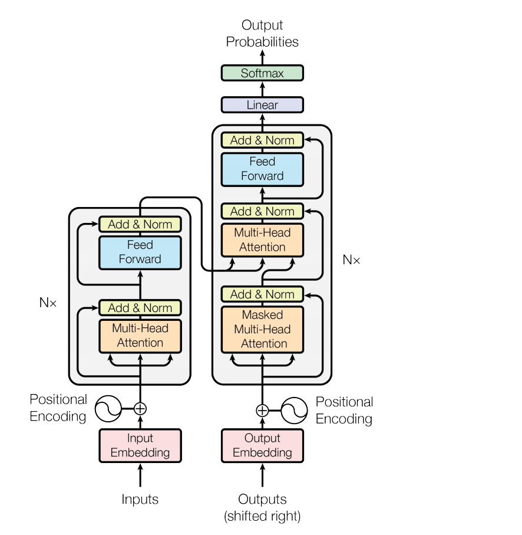

1. 在解决的是什么问题？模型变大后，显存不够的问题
2. 为何成功，标志/准是什么？不需要依赖编译器，不需要重新改写模型
3. 在前人基础上的关键创新是什么？使用纯pytorch来实现了简单的模型并行，与pipeline 并行是正交的
4. 关键结果有哪些？
5. 有哪些局限性？如何优化？
6. 这个工作可能有什么深远的影响？

## 1. 摘要

贡献在以下几方面：

* 实现了简单、高效的模型并行方法，只需要在已有的 PyTorch transformer 实现里修改几个地方
* 深入的分析了模型在数据并行和模型并行模式下，采用512个GPU后，能最大到76%的扩展效率（单机上是硬件峰值 TFLOPS 的 30%: 39TFlops)
* BERT 这类的模型里，layer norm的放置位置对于模型增大时精度变化至关重要
* 增大模型的大小，会让 GPT-2(8.3B)和 BERT（3.9B) 模型的结果精度都提高
* 我们的模型在测试集上 SOTA
* 开源在了 github.com/NVIDIA/Megatron-LM

