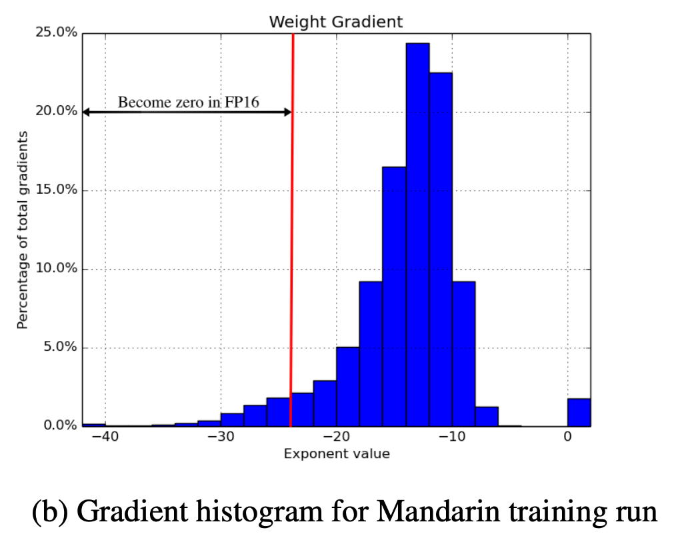

1. 在解决的是什么问题？降低训练的显存带宽和计算开销
2. 为何成功，标志/准是什么？显存降一半，计算开销也降低不少，模型精度不变。而且在各类任务以及非常大的数据集上都 work
3. 在前人基础上的关键创新是什么？使用简单，模型又不需要改动，使用半精度来计算，同时权重有一份单精度的值保存在优化器里
4. 关键结果有哪些？显存降一半，计算开销也降低不少，模型精度不变
5. 有哪些局限性？如何优化？有一些层不能用这种方法
6. 这个工作可能有什么深远的影响？

## 方法
weights, activation, gradientss 都是用 IEEE 半精度浮点数。因为这种格式的值域较小，提出了三种技术来防止关键信息的丢失：

1. 在优化器里保存一份单精度的 weight 拷贝，用来在优化器每一步里做累加: 这个拷贝近似为半精度浮点数后，就可以用来做 forward 和 backward 了 (此时如果太小了，不会变成 0 么)
2. 使用 loss-scaling 来保留住较小的梯度值，否则会变成0
3. 使用半精度浮点数累加到单精度的输出，在保存到内存之前在转换成半精度: FP16 arthmetic with accumulation in FP32: 是说矩阵乘法的输入是 fp16，但结果是 fp32？ 对，就是有些操作需要在运算时使用 fp32，然后再把这个结果转为 fp16。否则计算过程中精度较低，最终模型精度会有影响

使用混合精度训练后，节省显存的同时，能提高速度，原因是处理器上，半精度的算术运算会比单精度要快2-8倍

### 3.1 FP32 Master copy of weights
fwd, bwd 用的 fp16，但是在优化器里，weights 有一份 fp32 的 weights，这个 weights 会拷贝一份给 fwd 和 bwd 使用

上图是普通话训练过程中，每隔4000 个 iteration，给每个层的梯度做采样，可以看出:

1. 有 5% 的梯度在 fp16 下会是0( 幂**小于 -24** )，所以需要 loss scale 技术来把它们右移。否则乘以 learning rate 之后更小，就变零了
2. 梯度一般都特别小（指数是负的）

另外因为 fp16 的小数部分是 10 位的，所以如果权重和权重更新相比差异太大，超过了2048倍(2^11)，也会导致虽然权重更新非0（可被 fp16 表示），但是加法操作后，如果向右移位，也会变0。所以用 fp32 的 weights

假设是显存主要被激活值占了，所以即使使用混合精度，权重相比单精度要多了 50%，但是整体显存依然是节约了很多的。节省了近似一半，尤其是大 batch size 条件下

### 3.2  Loss scaling

FP16的 exponent bias ： [-14, 15]。由于看到 fp 16 值域里右侧的没有用到，而梯度又很小，有一些在 fp16的左侧，甚至表示不了，是0.所以就可以扩大一下。比如乘以8，这里的假设是 2^-27 之后的跟训练影响非常小，而 [-24, -24] 之间的范围是非常重要，需要保留的

比较高效的方案之一是 forward 之后，backward 开始前，把 loss 扩大一下，这样根据导数的脸是求导法则，梯度也是扩大了同样倍数。这样可以在权重更新时，把 scale 去掉。即任何权重操作前（grad clip, weight decay etc.）

采用 loss scale ，只要 backward 时，没有溢出的情况，那就没有任何副作用。溢出是可以通过检查计算出的权重的梯度来检查的。此时可以跳过当前的步骤

### 3.3
网络里的算子分为三类：向量乘积，规约，点维度的操作。这几类需要的方法不一样。

为了维持模型的精度，需要：

1. 对于向量乘积，需要把积的部分和使用 fp32 来累加，然后在写入内存前转为 fp16（相当于运算精度用 fp32，i/o 精度用 fp16）。否则会导致有些模型无法达到基线的精度。从 V 系列开始，NV 提供的 Tensor Cores 就可以给输入的 fp16 矩阵做乘法，把乘积的结果累加到 fp16 或者 fp32 （2017年 NV 提供的）。感觉这个就是软硬件协同设计的典范了，非常简单
2. 大的规约（向量里每个元素上的求和），应该使用 fp32。这些操作一般出现在 layernorm、softmax 等。这些类可以被实现为使用 fp16 I/O 精度，使用fp32 的计算精度。这个并不会拉慢速度，因为这些层是受内存带宽影响更大，对于算法速度不敏感
3. Point-wise（element wise） 操作，比如 non-linearities 和 harmand product（挨个元素的矩阵乘法），也是显存带宽限制的。所以可以用 fp32  或 fp16. 意思是 fp16 可能也不会差？

## 问题
1. 为何不是把梯度搞成 fp32 master copy的？因为梯度并不累加，每次都是算出来最新的

## TODO
1. 看一下 fp16 的值域？不太清楚 -24，和 -14 之间的关系
