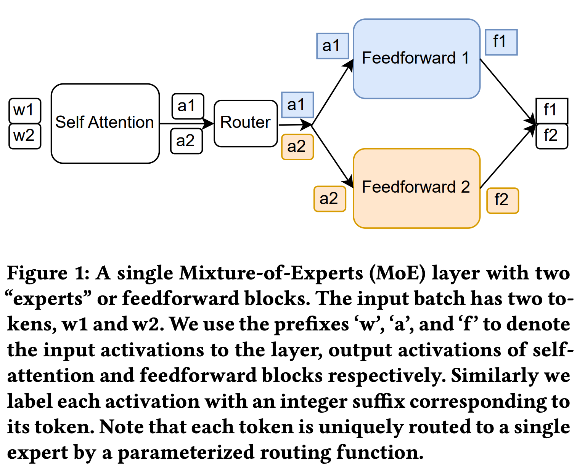
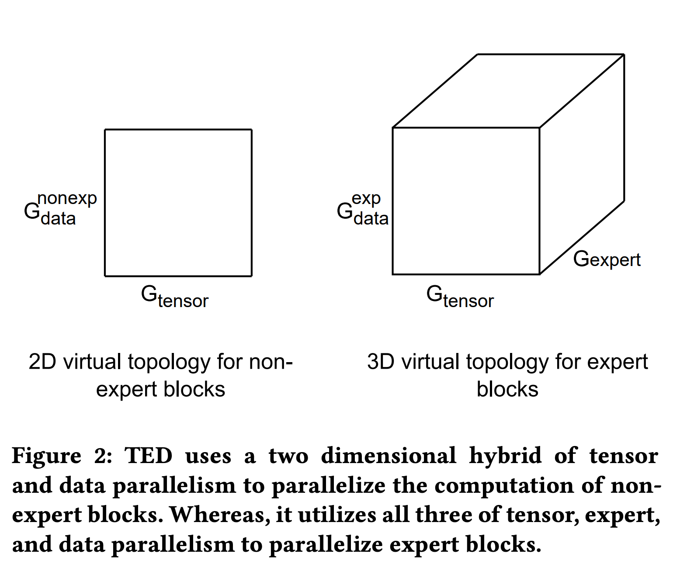
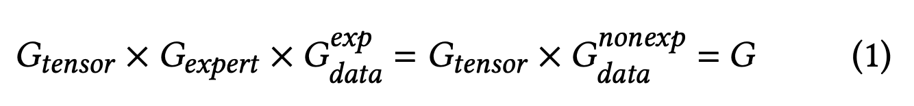
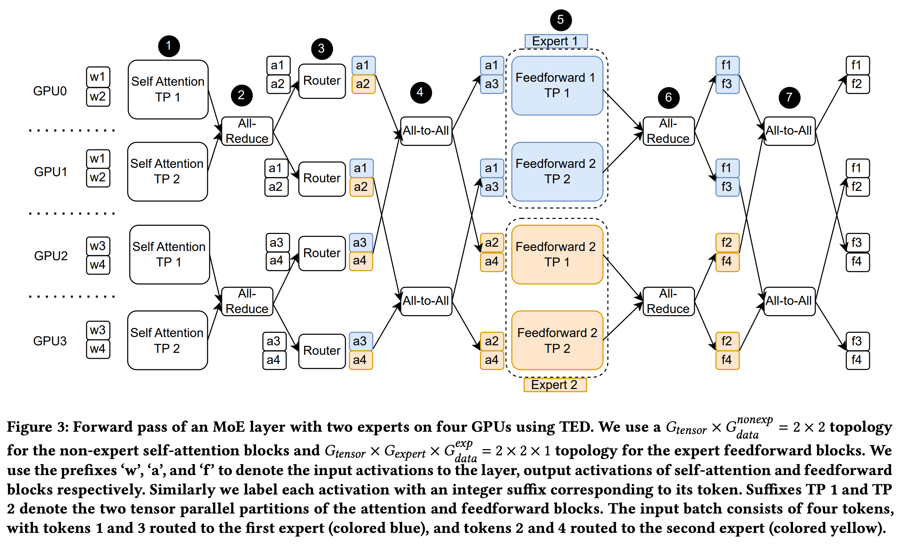

1. 在解决的是什么问题？高效训练更大的 base MoE 模型
2. 为何成功，标志/准是什么？在 40B MoE 模型上，128 V100 下比 baseline 快 26%（不算通信优化）。感觉创新反而是解决的显存和通信优化。MoE 本身就定义了 all2all 的操作。就是为不同卡上放不同的 expert 用的

3. 在前人基础上的关键创新是什么？结合了 ZeRO，Megatron 的 Tensor，Expert 并行来支撑更大的 MoE 基础模型。解决前面三种模型并行结合情况下遇到的 optimizer step 阶段遇到的显存尖峰。通信优化：减轻了不需要的通信，节省了大量的集合通信的时间
4. 关键结果有哪些？
5. 有哪些局限性？如何优化？
6. 这个工作可能有什么深远的影响？

## 1 介绍

下图里介绍了 batch 为2 的两个输入 token，经过 MoE layer 的过程。图里每个 token 只会被一个 expert 处理，每个token上有效计算的代价依然是固定的，跟 expert 数量是没关系的。

当前遇到问题是无法高效支持更大的模型。

主要贡献是三方面的：

1. 高可扩展的支持三方面维度的框架：ZeRO、Megatron LM 的 tensor，DeepSpeed MoE 的 expert 并行。来支持更高参数量的 MoE base 模型
2. 缓解上面三种并行带来的优化器 step 上的显存突增
3. 混合策略下的通信优化（哪些呢？

## 2 背景

### 2.1 Mixture-of-Experts

### 2.2 DP 和 ZeRO
DP 是对输入的数据做 batch 上的切分，大家各自消费不同的数据，然后在 bwd 之后进行梯度的 allreduce。平常说的 ZeRO 有三个阶段，各自把 优化器状态(optimizer state)，梯度(gradient)，参数(parameter) 进行切分。但本文里我们只考虑第一阶段，即在 dp 的ranks 之间切分优化器状态。

### 2.3 Expert Parallelism 和 DS MoE
在路由之后，在一个 MoE layer 里的 expert 块的计算和其他 expert 是独立的。所以 EP 利用这个特性，每个 GPU 上存放不同的 expert，这样可以并行计算。Tokens 是通过 all-to-all 通信来分发到对应的设备上。由于简单和高效，所以 EP 使用很广泛

### 2.4 Tensor 并行和 Megatron-LM
TP 是把网络里某层的计算划分到不同的 GPU 上。方法是把 self attention 里最后的 fully-connected layer 和 FFN 里的两个 layer 进行并发

## 3 TED：混合的 Tensor-Expert-Data 并行
相当于 TP 是直接可以在 expert 里用上的，而 ep 是说不用所有 MoE 都挤在一张卡上(好处是不需要 all2all），而是每张卡上

ep 只能用在 expert 部分上，所以 attention 里的非 expert 部分只能是 tp+dp，而只有 ffn 里的 expert 部分才能进行 ep。见下图2:

EP 所需的卡是从 DP 的组里拆出来的。我们设置 Gexpert 大小为模型里 expert 的数量（出于模型性能的考虑）。那么下面两个等式成立：

即非expert 部分的 dp = expert 部分的 dp * expert 部分的 ep

图里是一个 MoE 层的 fwd 过程，使用了两个 experts，4个 GPU，使用 TED

图里的输入，因为 TP=2，所以每份数据已经拷贝过了。实际就是两个 ddp，batch=2，即总共4份数据

图里看到把 self-attention 里非 expert 的部分(proj)和expert里的两个 ffn 的参数切分，第一部分放到了0和2，第二部分放到了1和3。 两个 TP groups 各自是谁？（用来做 AR）。谁组成了非 expert(proj) 部分的 dp？同样的这部分，也组成了后面 expert 部分的 ep（所以expert 部分 dp=1）。这4个 gpu，对于 expert parameters 而言，都是单个的 dp group，即能消费4份数据

## 问题：
1. 为什么 gpu0 和 gpu2 是一个 all-to-all group？因为他们是不同 expert 的同一个 TP 分片
2. 为什么 experts 这里 a1会有两份？因为 expert 里面也有 tp，所以复制两份输入，各自经过不同的参数
3. 为什么 Expert 部分 TP 之后立马 ar 而不是 all2all？因为有 tp
4. 再注意看看整体的输入和输出，此时是对应起来的

两次 ar 和两次 all2all 的总的通信量，在 fwd 里是一样的。（总感觉有点奇怪，但是通信开销不一样？）

## 4. 对优化器里，expert 部分状态的处理
因为它的 dp 部分比非 expert 的 dp 部分要大 E 倍
