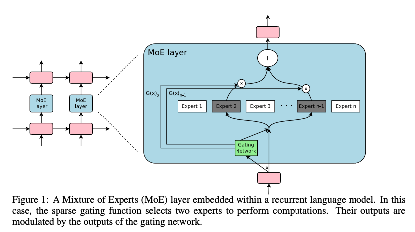
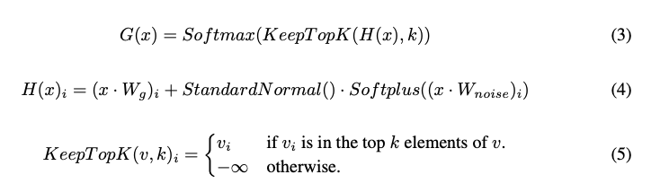
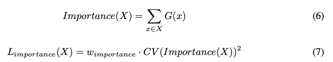

能不能别. 在解决的是什么问题？如何让模型很容易就变大，比如迅速增加 1000 倍 => 让单个层里面的参数显著增大，但计算量不增加
2. 为何成功，标志/准是什么？计算量没增加，但是模型容量/参数变大了，使用的是 Mixtures of experts，这种又叫高效、通用的条件计算(conditional computation)
3. 在前人基础上的关键创新是什么？ 1. 设计了 gating network，能够达到两个目标：实用到所有的 experts（重要性），把计算平均分配到experts上（负载均衡）。2. 提出两个技术来增加每个expert的batchsize，来最大化 GPU 的并行能力。 这几个方法可能naive：noisy-top-k gating, particular batching schemes, load-balancing loss, mixture-of-experts formalism
4. 关键结果有哪些？在语言模型上效果非常好
5. 有哪些局限性？如何优化？
6. 这个工作可能有什么深远的影响？ 是这个领域的种子论文，告诉大家这个新赛道可以卷

balancing losses

efficiency metrics (TFLOPS/GPU) 

**sparsity of parameters** is among thhe most important modelling principles in machine learning, being used with great success in e.g. Lasso with the l1 penalty, in SVM with the hinge loss
and convnet by setting connections outside the receptive field to zero. 前两个不懂，后面这个好理解。就是参数里每次只有一部分是有用的，有点像 droppath，dropout 一样。本论文里的参数稀疏指不同 experts 里的参数没有互相连接。**计算路径**
也是每个训练样本定制的. 这是第一篇提出实用、可扩展、通用的神经网络

除了 MoE，还有其他可以用来迅速增加模型参数的方法：

1. Dense Layers: 比如  conv layer，每个参数对应每个算子，只需要O（1）的计算量，增加参数量会增加训练时间
2. Embedding Layers(搜广推) : 这个会非常稀疏。可以增加它的 feature space，也可以增加维度。我们认为 MoE 层比embedding layer 要更强大。 Embedding layer 会被网卡带宽所限制，因为要通过网络发送出去。而 MoE 只受GPU算力限制。

## 摘要
网络吸收信息的容量主要受限制于参数量。条件计算，即网络的一部分是在一个样本粒度被激活的，曾经被提出来，作为显著增大网络容量而不会增加计算量的方法。但是实际中有明显的算法和性能挑战。本文中解决了这些挑战，最终实现了条件计算：达成了1000倍的容量提升，
而在GPU上只有少量的训练效率损失。我们提出的稀疏门控混合专家层(Sparsely-gated Mixture-of-Experts layer)，包含上千个 feed-forward sub-networks。

可训练的门网络决定每个样本上使用这些专家的稀疏组合。

## 1 介绍和相关工作

### 1.1 条件计算
在训练数据和模型大小上进行扩展对于深度学习的成功至关重要。当数据集显著增大，增加神经网络的容量（参数量）能得到更高精度。在文本，图片，语音等领域都适用。对于典型的深度学习模型，每个样本上整个模型都是被激活的，所以当模型大小和数据量样本增多时，
训练代价呈二次方增加。算力和分布式计算的发展缓慢，满足不了这种需求。

很多种条件计算方法被提出来，来增加模型容量而不增加算力成本。这些方法里，网络的大部分在每个样本下，是激活或者不激活的。门的决策是二进制、稀疏、或者连续，随机或者确定性的。多种**强化学习**形式和反向传播被提出来来训练门决策。

虽然这些思路在理论上很有潜力，但是至今没有工作展示了在模型容量上大量提升，训练时间或者模型质量。我们认为主要是以下几个挑战： 

* 现代就算设备，尤其是 GPU，运算非常快，但是对分支处理很慢。之前大部分工作目的是利用门策略来关闭或打开网络的大部分。
* 大批量对于性能至关重要，因为能均摊参数传递和更新的代价。条件计算减小了网络中被条件激活的网络的批量大小
* 网络带宽会是瓶颈。一个GPU集群可能有千倍于**设备间网络带宽**的**算力**。为了让一个算法的计算高效， 其计算和网络需求的相对比值需要超过这个比例。被当作一种条件计算形式的 Embedding layers，就是因为受限于网络带宽。因为 embeddings 通常需要
通过网络发送出去，所以交互数量(样本、参数)受限于网络带宽而非计算能力
* 取决于 scheme，可能需要损失项来达到每个样本或者每个chunk 上期望的稀疏程度。 Bengio 使用了三种类似项。这个问题即会影响模型质量，还会影响负载均衡
* 对于非常大的数据集，模型容量非常关键。而之前都是相对少的数据集，比如最多就60w。

我们第一次解决了以上挑战。最终发挥了条件计算的潜力。

### 1.2 我们的方法：稀疏门控混合专家层
我们提出了一种新的通用目的的神经网络组件：一个稀疏门控的混合专家网络层(MoE)。MoE 包含一系列专家，每个时一个简单的前向神经网络，和一个可训练的门网络，能选择一个稀疏组合的一组专家来处理每个输入（见图一）。b所有神经网络都是通过反向传播来联合训练的。

### 1.3 混合专家的相关工作

## 2 混合专家层的结构
MoE 层包含一个 n 个专家组成的集合 E1，...,En, 和一个 "gating network" G，它的输出是稀疏的 n 维向量。图一展示了 MoE 模块的概览。专家是神经网络，每个都有自己的参数。虽然原则上我们只需要专家接受同样大小的输入，输出同样大小的输出即可，但在本文里，
我们限制为专家为有一摸一样网络结构的 feed-forward 的网络，但是有自己单独的参数。

假设对于给定输入 x，G(x) 是门网络的输出，Ei(x) 是第i个专家的输出。MoE 层的输出 y 可以表示为如下：

y = sum(G(x)i*Ei(x))

由于G(x) 的输出是稀疏的，因此对于 G(x)i = 0 的专家，我们不需要计算它。我们的实验里有上千专家，但每个样本上，只需要计算几个，因此算力开销很小。除了这种普通的 MoE，还可以使用层次化的 MoE，比如两层 MoE。

### 2.1 门网络
**Softmax 门**: 简单的非稀疏的门函数是把输入和一个可训练的权重矩阵 Wg 相乘，然后使用 softmax 函数： G(x) = Softmax(x*Wg)

**Noisy Top-K 门**: 在 Sotmax gating 里添加两个组件：sparsity 和 噪音。添加 Gaussian 噪音，然后只取 top k，其他的设置为负无穷(会让对应的门值为0)。稀疏的目的是节省计算。虽然这种稀疏会产生一些理论上可怕的非连续的门输出，但是实际并没有
发现有什么问题。噪音项对于负载均衡有帮助，附录A里有介绍。每个组件上噪音的大小受第二个可训练的参数矩阵 Wnoise 控制。

训练门网络：通过简单的反向传播来训练门网络。如果选 k > 1，top k 的专家的门值有对门的参数的非零导数。这种偶尔敏感的行为在 Bengio 2013 里描述过：noisy rectifiers. 梯度也是通过门网络传播到它输入上。我们的方法和 Bengio 2015 的不同，
他使用了布尔门，和 reinforce风格的方法来训练网络。

## 3 解决性能问题
### 3.1 缩小的batch
由于门网络给每个样本 选择k/n 个专家，所以对于一个有 b 个样本的batch，每个专家接收到更小的样本即 bk/n << b 个样本。这会导致专家数量增大后，这种简单版本的 MoE 实现非常低效。解决方法是让原始的 batchsize 尽可能大。但是 batchsize 受限于能够保存forward 和 backward 之间激活值的显存大小。
我们提出了一下方法来增加 batchsize

**混合数据并行和模型并行**：我们利用数据并行，不同 批次数据在模型上同步执行，以便于可以在 MoE 层之前进行合并。标准层和门网络是根据传统的数据并行方案的。但对每个专家，只保留一个共享的。MoE 里的每个专家接收输入batch 里所有数据并行的相关样本的结合。同样的设备既是
数据并行副本（标准层和门网络），也是模型并行的分片（每个host了专家里的一个子集）。如果模型在d个设备上，每个设备处理一个大小为 b 的批次，每个专家会接收到大约 kbd/n 大小的样本。因此，我们达到专家上batchsize 提高了 d 倍。

在层次化 MoE 里(Section B)，主门网络使用数据并行，而第二个 MoE 使用模型并行。每个第二层的 MoE在一个卡上。

这种技术让我们通过比例增加训练集群里的设备，来增加专家的数量（因此也是参数量）。总的 batchsize 增加，保持每个专家上的 batchsize 固定的。这样每个设备上的显存和带宽需求是常量，step times、处理训练样本等于模型里参数量。我们的目标是训练一个 1T 参数量的模型
在一T word 的语料上。还没有扩展系统到如此大规模，但是添加更多硬件即可做到。

** 利用卷积的优势** : 语言模型里，使用前一层一样的 MoE。没太看懂，好像是 LSTM 里的特性

### 3.2 网络带宽
另一个在分布式计算中的重大性能问题是网络带宽。由于专家是静态的(stationary)，门参数的数量相对小，大部分通信涉及发送专家的**输入**和**输出**到网络之间。为了计算效率起见，需要一个专家的计算量与输入输出的比例大于设备上计算与通信能力的比值。
对于 GPU，这个可能是几千比一。我们的实验里，每个专家有一个包含上千个 RELU激活单元的隐层。因为专家里的权重矩阵大小是 `input_size * hidden_size` 和 `hidden_size * output_size` ，所以上述计算与输入输出的比例等于隐层的大小。非常方便地，
我们可以使用更大隐层或者更多隐层的方法来增大计算效率。(此时输入输出的大小没变，变的只是计算量)

## 4 均衡专家的利用率
观察到门网络趋向于收敛到一个状态：总是给相同的几个专家产出大的权重。这种不均衡是自增强的，随着偏爱的专家被训练的越多，因此也被门网络选择的多。Eigen 2013 时使用在训练之处硬限制来避免局部最小值。Bengio 2015 包含一个软限制，
作用在batch-wise average of each gate。它还包含了两个额外的 loss。一个控制样本级的稀疏，我们没包含，因为 topk 已经保证了稀疏。第三个 loss 鼓励门的多样性。 我们的实验里发现，当专家专家化后（几个循环之后），门自然就多样化了。

我们采用软限制。我们定义**一个专家**对于**一个训练样本批次**的重要性是对这个专家的 batchwise sum 的众多门值(gate values)。定义额外的loss Limportance，是增加在额外的模型的损失函数上。这个loss等于 coefficient of variation
of the set of importance values, multiplied by a hand-tuned scaling factor Wimportance. 这个额外的loss 鼓励各个专家有一样的重要性。

重要性只能说让每个专家都参与了

虽然这个 loss 函数能够保证一样的重要性，但是专家可能收到非常不一样**数量**的样本。比如一个专家收到几个非常大权重的样本，另一个收到小权重的样本。这会导致分布式硬件上的内存和性能问题。为了解决这个，我们引入了第二个损失函数 Lload，它
确保均衡的负载。附录 A 包含这个函数的定义，和实验结果

## 问题
1. experts 是怎么部署的，是一台主机上，能有好几个专家？只是需要谁，就把它参数切换回来？
2. 3.1 里，本来 batchsize 是 db，现在还是会被分成 k/n 个呢，只不过原来是1卡，现在是d卡。 而其中提到的多个专家之间是模型并行，但传统模型并行是解决算力不够，一个算子用多个卡来计算，这里是不同卡上模型不同，而且只走其中 topk 个。
3. 为啥门网络能选出正确的，万一 top2 选出的就不靠谱呢？
4. top k 时，按照什么排序？
