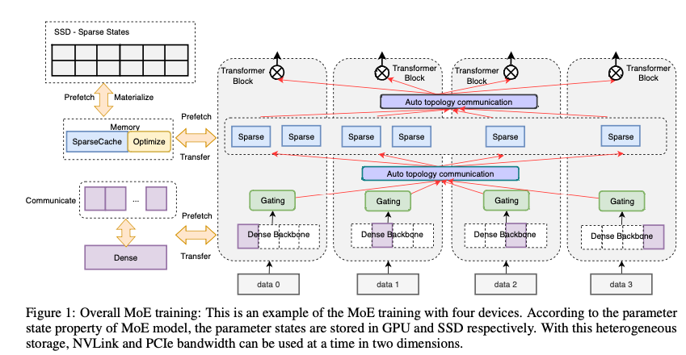
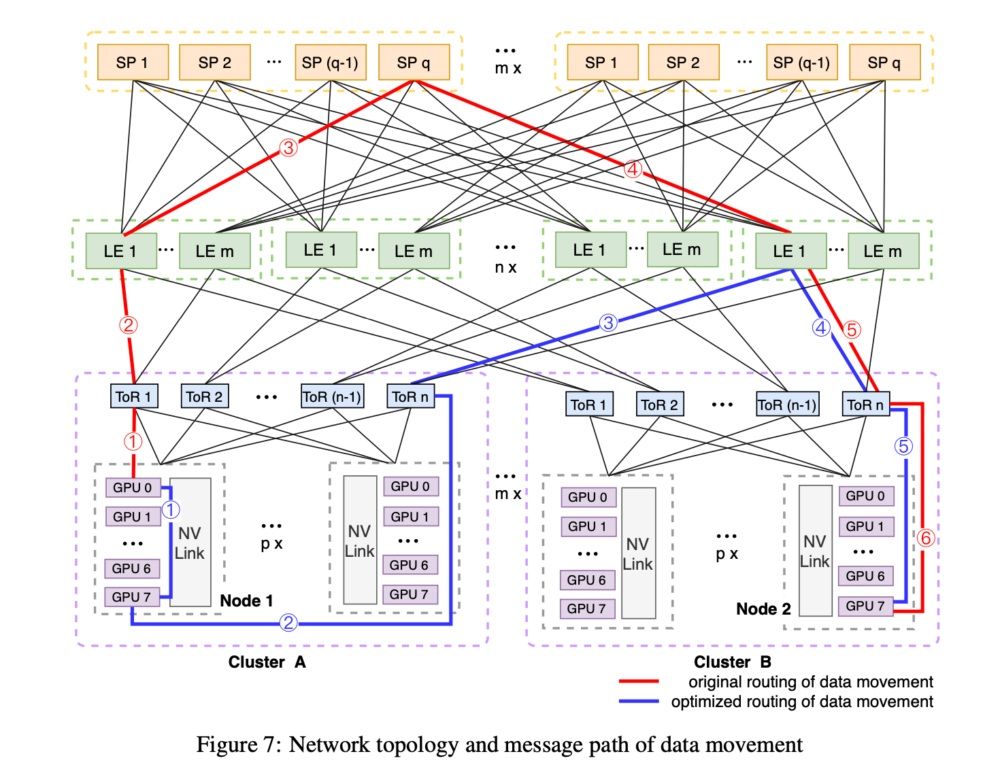

1. 在解决的是什么问题？
2. 为何成功，标志/准是什么？
3. 在前人基础上的关键创新是什么？
4. 关键结果有哪些？
5. 有哪些局限性？如何优化？
6. 这个工作可能有什么深远的影响？

## 摘要
大量实现表明，SE-MoE 可以训练一个 统一 Feature 优化(Unified Feature Optimization(UFO)) 的模型，使用 Sparsely-Gated Mixture-of-Experts 模型，有120亿参数，8天里用48个 A100 GPU卡就训好了。比当前 DeepSpeed 的训练吞吐量要高 33% (tokens per second)，推理通吐量高13%。而且在不均衡的 MoE 任务里，比如 UFO,SE-MoE 可达到 64% 的吞吐量，而降低18% 的显存。

## 2 MoE 训练设计
影响模型的性能和效果的，有两个重要因素：模型规模和数据大小

DeepSpeed Zero-infinity 可以使用 DGX-2 节点上的 512 个 V100 来训练 30T 参数的模型。它利用了 HBM，CPU 内存，SSDs。同时使用了 ZeRO 和 parameter prefetch 的策略来**减少存储(主要是显存）**的占用，提高训练效率。但是 SSD 的写入次数有限，而且在达到存储容量时会变慢。

可以提出一些优化方法来解决 SSD 的问题：

1. MoE 模型的参数根据激活值类型分为两类：sparse 和 dense。而sparse 部分因为占比很大而导致很容易超过 GPU 显存限制。所以按照下图1，我们设计利用层次存储来分别存放稀疏和dense的参数。
2. 为了缓解由于数据在不同设备之间的搬运带来的性能下降，提出了创新的策略--2D prefetch 调度。

下文里主要介绍三部分：层次化存储，2D prefetch 调度，融合通信

### 2.1 Hierarchical Storage
假设 D 和 S 分别是 dense 和 sparse 参数的总量，L 代表 MoE 层的数量。那么当总共的 SSD memory，CPU 和 GPU 显存分别是 Mssd, Mcpu 和 Mgpu，N 是GPU个数。

那么 dense 参数和优化器状态总共需要 16D 字节，而 sparse 参数和梯度占 `2alpha*S/L+2alpha*S/L = 4alpha*S/L` 

GPU-Node: `16D + 4alpha*S/L <= MGPU*N`

CPU-Node: `16apha*S <= Mcpu*N`

CPU-Node: `12*S <= Mssd*N`

整个 MoE 模型的规模是： P=S+D

如之前所说，sparse 参数放到了 SSD 的文件里，因为 flash 媒介的限制，PCIe 带宽 和 NVMe 的协议， SSD 的延迟和有限擦除有限制。为了避免MoE 训练场景下频繁写入，我们使用了 Intel Optane Persistent Memory，他是新的存储媒介，提供了 DRAM 那样的字节寻址，以及 SSD 那样的持久化存储。Optane PMem 通过 DIMM 接口插上，使用 DDR-T 协议（在DDR4纸上的协议）。能够比 SSD 更高的带宽和更低的延迟。用 Ext4，AppDirect 模式而非 memory 模式，我们可以直接加载、存储 GPU bypass page cache 和 kernel，而不需要任何打断和上下文切换

### 2.2 2D Prefetch Scheduling
由于使用了层次化的存储来保存稀疏参数状态和dense参数状态，所以在不同设备间传输数据非常耗时。因此提出了 2D 的 prefetch scheduling 策略：让参数的计算可以重叠。dense 参数是分片的，使用了 ZeRO-3 的策略，见图1，而完整的 dense 参数可以在水平方向通过高速的 NVLink 通信来prefetch到，这样就完成了预期的 data parallel。类似的，sparse 参数可以通过 GPU 上垂直方向的 PCIe 来预取。在SSD和GPU之间可以使用 CPU 显存来做 LFU 这类的 cache 机制。

### 2.3 Fusion Communication
Fusion parameters: 对 Dense 部分使用 ZeRO-3 的数据并行，此时可以做参数的聚合，这样通信效率高。对于 sparse 的模型参数，是否需要这样的 ZeRO-3 拆分呢？

Gradient Bucket: 就是 DDP 里的做法，ZeRO 里也用到了

## 3 MoE Inference Design

## 4 Efficient methods on MoE model
挑战：

1. load imbalance due to unevent 输入数据: Elastic MoE Training
2. 大量的跨主机通信: Resource-aware Communication to speed up across different clusters
3. 存储限制: 创新的 embedding partition method

### 4.2 Resource-Aware Communication
在 MoE 模型训练和推理时，expert 并行的模式下，需要大量的 GPU 卡之间的 All2All 通信。

假设有 m 个集群，其中每个集群里 p个节点共享同一个 Tor 交换机。所有 leaf switches(LE) 和 spin 交换机 (SP) 被切分为 n 和 m 个组。如图7所示，第i个组的 leaf 交换机直接和所有的 Tor 交换机连接，而且是不同 cluster 上的 rank i。而spin 交换机是用来跨 leaf 交换机通信用的。由于 spin 交换机的**带宽**(那如果spin交换机和leaf交换机是同一种型号呢？）比 leaf 交换机的带宽要低，因此通信时要尽量利用叶子交换机来获取更好的性能。例如，假设所有的 GPU0 是连接到 ToR1的，而所有 GPU7 都是连接到 ToRn（应该是 ToR7) 的，可以看到从cluster A 里的 Node1 到 Cluster B 里的 GPU7会经过如下路由：[LE1, SPq, LE1]，如红线所示，这样开销大，而且引起潜在的资源竞争。更好的方式是如蓝色线所示，使用 NVLink 来把 GPU0 挪到 GPU7，然后通过 rank7 之间的跨 cluster 通信的方法，此时只经过 LE1 交换机。

而[nv官方给的 dgx-2](https://developer.nvidia.com/blog/introducing-hgx-a100-most-powerful-accelerated-server-platform-for-ai-hpc/)，以及[这里的图](https://www.microway.com/hpc-tech-tips/dgx-a100-review-throughput-and-hardware-summary/#DGX-A100-Review-Summary)，拓扑大概长这样:

因此，上述拓扑结构下，节点里相同 rank 之间的速度比不同rank之间的速度要快。基于这种特性。我们建议在推理和训练是，使用优化后的，层次化的拓扑感知的 all2all 通信。如图8 所示，为了避免不同rank之间的跨节点通信，首先实现了通过 NVSwitch 来在节点内部收集数据。然后把相同 rank 的主机之间分为同一个 group 来做节点之间的 alltoall ，这样避免跨 rails(spin 交换机) 的通信。这种方法下，p2p 跨节点的通信会增加 p ，p 是一个节点 GPU 的数量，这个完全能把节点间的带宽利用起来。这里提到的 p 没太懂，是因为额外增加异步 rank7 -> rank0 导致的嘛？但这个速度很快，而且占比总耗时也不是 p 倍关系？

### 4.3 数据并行里的 Embedding Partition
大规模训练里，embedding table 是最大的参数部分。在 embedding 分片上，已有一些工作。Megatron 是在行上做切分，变成 tensor-slicing 的并行来减少显存占用。而 EmbedRace 是提出了列维度的切分，来达到更好的通信平衡。当输入数据在每个进程上不一致(啥意思？）,是没有高效的方法的

## TODO
1. 看看 MoE Inference Design 里的两个创新点

## 问题
1. Checkpoint 技术在 MoE 上有用吗？
2. MoE 的速度是怎么样的
3. 我们是不是也需要 ZeRO3？
