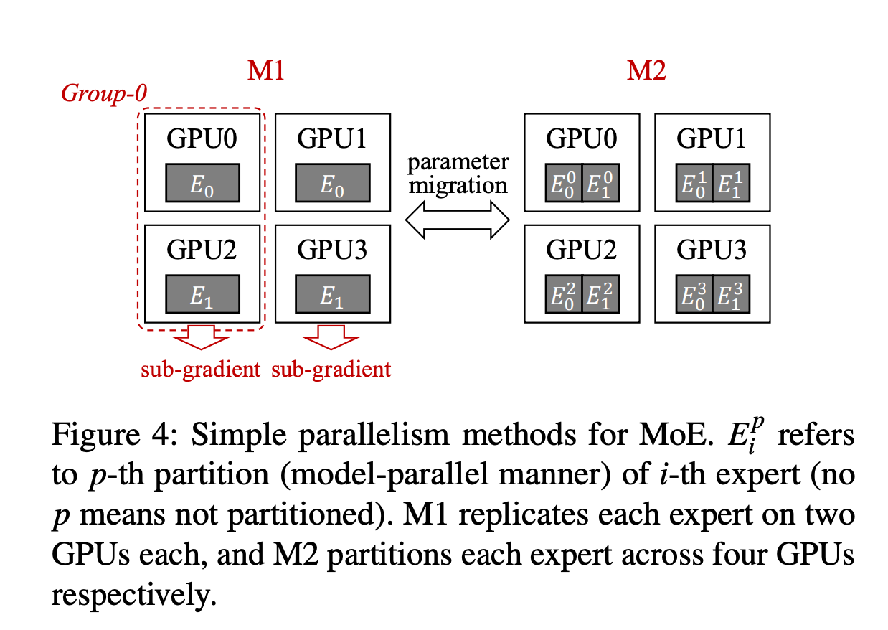
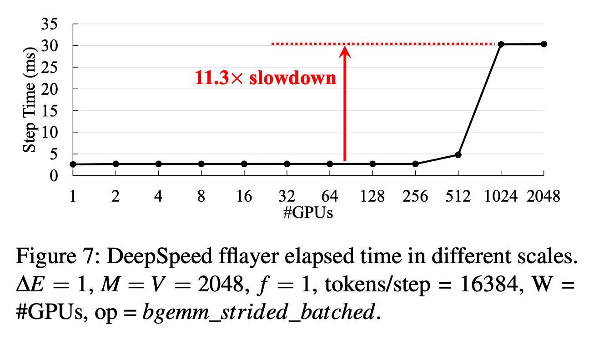
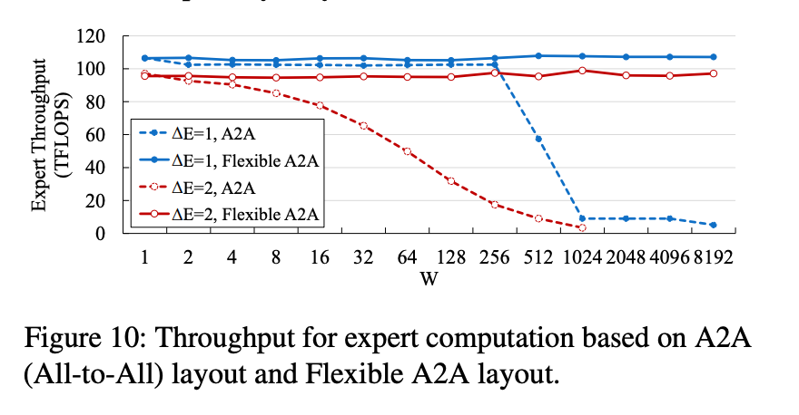

1. 在解决的是什么问题？MoE 自身是动态的，但是目前框架里支持的是静态并行/ppieline
2. 为何成功，标志/准是什么？
3. 在前人基础上的关键创新是什么？1.adaptive parallelism switching(MP) 2.adaptive pipelining at runtime 3.two-diemnsional hierarchical algorithm for all2all.
4. 关键结果有哪些？在16GPU规模上4.96倍提速，2048GPU上5.75倍提速。
5. 有哪些局限性？如何优化？
6. 这个工作可能有什么深远的影响？


Tutel 只是允许在每次迭代设置不同 expert capacity，**不产生**任何额外的切换开销(通过adaptive pipelining 做到的）。保证**不 drop tokens**，但是没法避免  zero-padding

two-dimensional hierarchical(2DH) All-to-All

flexible All-to-All enable efficient MoE dispatch/combine in exa-scale (4096 A100)

主要贡献：

1. 详细分析 MoE 的动态特性和现有 ML 框架里的挑战
2. 高效处理MoE的动态负载：adaptive parallelism switch 和 adaptive pipelining。分别能给单个 layer 加速：1.74 和 2 倍
3. 提出创新的 2DH All-to-All 算法 和 flexiable all-to-all，能让 2048 A100 加速 20.7倍，而且能在超大的 4096 规模上运行
4. 实现了稀疏版本：SwinV2-MoE 这个视觉模型

## 2 背景和动机
### 2.1 背景

MOE以及倍经典的 ML 算法上用过了，在大规模的 DNN 模型里，是以跨 GPU 的layer，而且部分交换来自不同 GPU 的 hidden features。
每个输入样本会被分为 n(>=1) 个 tokens


1. 首先运行 gating function，决定每个输入被切分之后每一块的目的GPU
2. 后续通过 all-to-all 通信原语(dispatch)之后，每个 GPU 运行自己的 expert，就是一个 feed-forward layer
3. 然后执行第二个 all-to-all（combine）来把对应的每个 token 的结果发挥来源地。

图2 展示了一个例子：


图里每个GPU上一个 expert(i)，G0 代表每个GPU上都相同的 gating function。不同颜色或者风格代表不同的样本(输入里的列，既有bs=2，即两个样本)，不同梯度的色彩代表同一个样本被切分后的tokens(输入里的行，即被切为6片。为啥不是3片？)
上图展示的是top1 routing，capacity=1.0

**Dynamic workload of MoE** MoE 里动态负载的原因主要有两个：

1. Token路由策略：会把每个token路由给多个experts(top k)，而tokens在expert里的分布是不均匀的。这样每个 iter 里每个expert上要处理的 tokens 数量动态改变的
2. 动态的 expert capacity. 每个expert的负载容量受 expert capacity 所限制，定义为一个 expert 最大能处理的tokens数量。

### 2.2 静态的并行
如果想利用多GPU加速某个expert，就很困难。之前的论文说明更多MOE的收益通常会快速消失(>256)。因此大规模训练时，MoE layers 通常需要的experts数量相比较 GPU 数量而言很少，同一个expert上会分配多个GPU来提高吞吐。

据咋们的试验，静态并行方法不适合动态的负载：使用P1（DP)和P2（MP)两种并行方法来测试，发现在不同的f下，两者效率不一样，两者之间存在7.39%~27.76%的效率差异。

图4



其中M1这种并行下：红色框是 MoE 的group0，他们之间做all2all。而整体是一个dp的group，Ei之间需要allreduce梯度，因为每个只计算出了子梯度

M2这种并行下：总共两个E，而且每个被切分为了4份。这里没有dp

所以不需要 dp+mp这种组合吗？但只要有sharding，应该都是dp+mp了

但是现有系统里动态适应做并行切换(adaptive parallelism switching)比较难。比如下图4里的两种方法需要每个GPU上存储不同的模型参数。因此两者切换，会导致大量运行时的参数迁移的开销。而且不同并行策略可能在访问输入、同步梯度时都有一些限制，比如会和其他策略交织在一起。

### 2.3 静态的pipeline
如图2所示的MoE layer 上，GPU使用率很低，原因是顺序运行 all-to-all 和 fflayer 来做 dispatch 和 combine。由于 all2all 里大部分是GPU间拷贝数据，并不是计算密集型，所以可以通过把它和fflayer这个数值计算进行流水来提高对 GPU 计算能力的使用。表一里展示了通过把all2all和fflayer计算叠加在一起，加速了1.86倍。

但是发现静态pipeline策略并不能解决动态负载。如图5里展示的，不同的 MoE setting和规模下，对应的最优 pipelining 策略里，all2all 算法不同、pipeline 度数也不同。说明需要再运行时动态适配当前的 setting 来做动态 pipeline 策略：主要是 overlap 时的并行度。

而且动态调整需要联合计算和通信一起来做：计算和通信之间的互相影响，让只考虑单个影响情况下很难找到最优的pipeline 策略。我们大量实验表明，不同的 all-to-all 算法即使吞吐一样，当引入并行的其他计算时，对两者的影响不一样。

### 2.4 无法扩展的 MoE Dispatch & Combine
发现 All-to-All 的实现在大规模下表现很差。

**小消息的传输** 大部分DL框架都是利用 nccl p2p api 来实现 线性的all-to-all 算法，见上述算法一。有n个GPU的情况下，每个GPU会把自己总共的 S 字节划分为 n 个 chunks (每个是 S/n 字节)，然后通所有其他人执行P2P通信。当GPU数量变大后，任意两个GPU间传输的 S/n 的 chunk size 会变的特别小，就很难
利用好 NVLink 和 HDR 的带宽了（见图6）。S 是固定的，只由模型自己决定

不像最新的 allreduce 实现，能在数据大小和网络拓扑下选择不同的通信算法，all-to-all 的实现只有一个算法，它在S很大而且很小规模下比较好（比如图6里的128KiB，GPU 数量<=64)。这让 MoE 通信很难适应动态负载，尤其是超大规模下。

算法1:线性 All-to-All

```
all2all_linear(output, input) # input: 要dispatch的输入激活值，返会从别人那里cobmine到的激活值
n = ngpus, S = sizeof input
chunksize = S/n
for r = 0; r < n; r++ do # 和每个其他 GPU 通信
    loc = r*chunksize, peer = r
    ncclSend(input[loc], chunksize, peer)
    ncclRecv(output[loc], chunksize, peer)
end for
```

**计算layout不合适** 


发现目前系统的扩展问题不仅仅有通信的原因，还有计算的原因。例如，图7里， DeepSpeed MoE 层里通过不同数量 GPU 下，计算耗时从单个GPU上的耗时增加到了2048GPU上的30.2ms，变慢了11.3倍。经过 profiling 发现主要是 All-to-All 原语导致的输出 layout变化。图7里，当GPU数量从1增加到2048，此时 matmul 的 shape 从 A(1,delta(E),16384,M)变到B(2048,delta(E),8,M)。可见第三维度上差异非常大(相当于这个向量从矮胖变成了高细），这个对matmul效率影响很大，pytorch里相当于 bgemm_strided_batched 操作的效率只有原来的8.8%的计算吞吐率。

## 3 系统设计
### 3.1 Flexible all-to-all
MoE 里的all-2-all 可以当做对 tensor layout的转换：把输入的tensor从(E,delta(C),M)到(W,delta(E),delta(C),M)(即接收时，直接把各个碎片在第一维append起来的，此时和发送的维度不一样了)。大部分框架（比如 DS 和 Fairseq）直接把这个dispatch的输出当做后面计算的输入，这个是潜在的由于shapes在expert 数量很大情况下会让计算低效。

TUTEL解决这种低效的方法是使用不同的 all-2-all接口，根据表3，flexible all2all扩展了两个参数：

1. 需要拼接的维度
2. 需要切分的维度

这个 flexible all-to-all的作用是让dispatch输出的形状不依赖于W（即world size 变了不影响）。解决 2.4 里提到的 compute layout 不合适(变的很碎）的问题

图10展示了在固定layout前后(flexible)，expert计算的时间变化



### 3.4 Two dimensional Hierarchical All-to-All
为了解决2.4里提到的小消息传输时对带宽利用率不高的问题，提出了聚合本地多个GPU上，把发给同一个远端GPU的数据包进行聚合的方法。可以通过把小的数据包合并成一个大包来避免发送很多小包，这样显著提高带宽利用率。然而高效的实现大规模下这个特性很难

**挑战** 随着规模变大，怎么让合并的这个操作的开销依然很小？解法就是先把非连续的空间变成连续的，然后再发送。
当为了在一个节点内部，有m个gpu上聚合数据片，这m个卡，每个都需要交换 S/m 大小的每片数据，等价于在执行 n/m 次，每次 S/n 大小的分片，如图15里 navie local aggregation 里的阶段一所示。这个节点内部all2all的操作按理是固定的，因为S/m 的每片大小是固定的，不依赖于n，但是超出预料的是，实际上随着n扩大，由于GPU上的 n/m 次对不连续内存的访问，会导致耗时增加（还是因为切的太细了，虽然交换的数据大小没变，但是分成了好几次了。即通信的总量没变，但是为了通信，需要仿存的次数变多了。所以每个GPU上都需要O(n/m)次仿存。而且，在S=128MiB、m=8下，观察到节点内的 all-to-all 处理消耗在n=8上近似 600us，而n=2048下，增加到到约5ms

**算法** 为了避免大规模下all-2-all的性能优于小消息和建立大量链接导致变慢，提出了二维的层次 all-to-all 算法：把原来多个链接上传输小消息变为在一个连接上传输大消息。利用 NVLink来在每个节点内部聚合。

为了避免由于访问非连续内存导致的变慢，2DH all-to-all 包含额外的阶段来把非连续的分片拷贝到连续的地址空间里。具体点，图15里展示了2DH里all-to-all的顺序图。并没有像naive那样直接执行节点内的all-to-all，我们受限把目的地相同的数据拷贝到一起，然后执行节点内的all-to-all（阶段2）。然后把有相同远端GPU目的地的数据分片拷贝放到一起(阶段3)，最后执行节点间的all-to-all（阶段4）。通过使用 stride memory copies，2DH all-to-all达到高带宽利用率，让前三个阶段的代价地，而且是n的常数量级。这个算法的收益在当S/n越来越小时收益变大（即数据量更小或者GPU数量变多）。这个对 rail-optimized infiniband网络也是有用的，因为减少了夸rail的通信。


## TODO
1. 可以看看3.3

## 问题
0. 为什么叫 Linear All-to-All
1. 它提出的 all2all 有两种？
2. 没太明白 expert capacity 干嘛的
