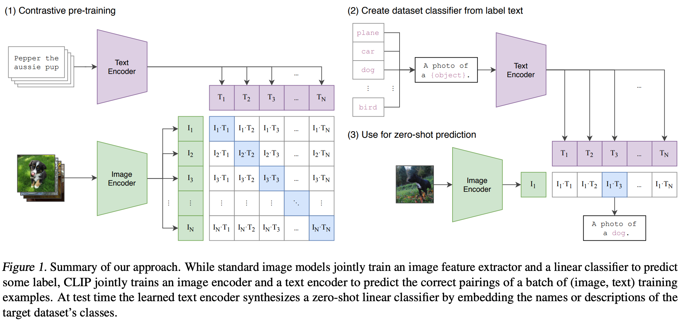

1. 在解决的是什么问题？
2. 为何成功，标志/准是什么？
3. 在前人基础上的关键创新是什么？
4. 关键结果有哪些？
5. 有哪些局限性？如何优化？
6. 这个工作可能有什么深远的影响？


没看懂的是为什么 clip github 首页上的例子里，两个矩阵相乘之后，就可以算相似度呢？而且输出的就是单词了，而不是字母或者没有含义的

```

similarity = (100.0 * image_features @ text_features.T).softmax(dim=-1)
values, indices = similarity[0].topk(5)
```

## 摘要
我们证明简单的预训练：预测图片上标题就可以是高效并且可扩展的方式来学会 SOTA 的 image 表征，在 4亿图文对上就可以做。预训练之后，就可以使用自研语言来指代学到的视觉概念，产生的 zero-shot 的迁移到下游任务上。们在30个不同的已有的 cv 数据集，比如 OCR，视频里的动作识别，地理位置，其他各种细粒度的物体分类。这个模型很容易迁移到更多类任务上

任务无关的目标，比如自回归(autoregressive)(预测下一个）和语言掩码模型（完形填空）方式可以在计算，模型大小，数据方面scale，能力能稳定提升。这种标准的“文本到文本”的方式是任务无关的架构，可以 zero-shot 迁移到下游数据集上，移除了需要特定的输出头或者数据集特定定制。旗舰系统就是 GPT-3，它可以用在非常多的系统上，只需要少量或者无须特定领域的数据集。

2017 年时已经有人做了类似的工作，发现有 zero-shot 能力，但是当时没有 transformer，也没有 CLIP 这里几个月的算力支持，也没有 CLIP 里 400M 的数据集。之后也有人做了文本弱监督相关的工作，但是作者认为由于训练的时间和数据集规模没有上去，所以效果并不好。

CLIP 是一种方法，里面使用了从 ResNet 到 VIT 的各种以及不同大小的模型，发现模型增大，能力就变强

更加稳健：当效果和有监督任务持平时，CLIP 的泛化能力更加强（香蕉的那个例子，对抗样本里有监督任务在瞎猜）

MOCO 或者 MAE 里面都是单纯的视觉特征，而一旦把语言和图像结合到一起就有了多模态的能力，就有 zero-shot 迁移能力

WIT：WebImageText 数据集


## 2 方法

预测换为对比目标，效率就提升上去了。OpenAI 的 GPT 都是预测类的方法，唯独 CLIP 为了训练效率考量，使用的是对比学习的方法。

约束放宽，训练后的效果就更高了

这里应该放个图

投射层的作用是学习如何从单模态变到多模态

利用**对称式的目标函数**(对比学习的标配）

CLIP 的方式跟之前的对比学习没有本质区别，差异主要是单模态换为了多模态。

两个有趣的细节：
由于数据集非常大:
1. 所以不存在之前同类工作里的 overfiting 的事情，所以很简单。文本和图像编码器都不需要提前训练
2. 使用了线性投射层（不像之前的 SImLR，MoCO 等用了非线性，高10个点）
3. 不需要复杂的数据增强，唯一用的是随机裁剪
4. 由于数据量太大，模型太大，实在不好调参数，所以把 temperature 这个对比学习里非常重要的参数设置为标量，自己学习了

### 2.4 Choosing and Scaling a Model
```
# image_encoder - ResNet or Vision Transformer
# text_encoder  - CBOW or Text Transformer
# I[n, h, w, c] - minibatch of aligned images
# T[n, l]       - minibatch of aligned texts
# W_i[d_i, d_e] - learned proj of image to embed
# W_t[d_t, d_e] - learned proj of text to embed
# t             - learned temperature parameter

# extract feature representations of each modality
I_f = image_encoder(I) #[n, d_i]
T_f = text_encoder(T) #[n, d_t]

# joint multimodal embedding [n, d_e]
I_e = l2_normalize(np.dot(I_f, W_i), axis=1)
T_e = l2_normalize(np.dot(T_f, W_t), axis=1)

# scaled pairwise cosine similarities [n, n]
logits = np.dot(I_e, T_e.T) * np.exp(t) #

# symmetric loss function
labels = np.arange(n)
loss_i = cross_entropy_loss(logits, labels, axis=0) # 交叉熵是什么意思？
loss_t = cross_entropy_loss(logits, labels, axis=1) # 
loss = (loss_i + loss_t)/2
```
### 2.5 Training
视觉这里用了8个：5 ResNets，3个 VIT。

训练好之后，又在更大尺寸上 finetune（ViT-L/14@336px)，方法来自 FixRes 这篇论文

## 3 实验
### 3.1 Zero-Shot Transfer

动机：之前的工作(MOCO, SimCLR, DINO) 都是在学习一种表征能力(representation learning)，即使你学到了很好的特征，但你一旦放到下游任务就又涉及到各种下游数据去微调，所以又涉及复杂的事情：比如下游任务可能不好收集数据，数据分布飘逸(distribution shift)不一样。能否训练一个模型，到下游就不需要微调了呢？用文本作为引导

#### 3.1.4 Prompt Engineering and Ensemble

它发生在微调或者推理的时候，但是效果又好，又不需要像预训练那样投入大量资源。这里的prompt指提示，即文本引导。

问题：
1. 歧义性：polysemy，比如 construction cranes 和 cranes 都是鹤，但是当出现在建筑工地里，前者就代表起重机
2. distribution gap：预训练时候遇到的都是文本(描述了整个图片场景），而非单个单词(推理时候的类别）。使用 "A photo of a {label}"的方式，积极让 ImageNet 上提升了1.3%。这个模版里 label 肯定是一个名次，所以也解决了一部分歧义性的问题，比如 remote 就肯定是遥控器而非遥远。类似地，在不同的数据集上做推理时，可以再加一些限定性描述，比如 Oxford-IIIT Pets ，使用 "A photo of a {label}, a type of pet"。有趣的是后来发现如果要做 ocr 任务，使用双引号比较好

使用 prompt ensemble 也可以提升，他们在 imagenet 上用了 80 个模版

inear Probe 是对比学习里面，把预训练好的模型冻住，用来抽取特征，而只训练最后一层那个 fc 分类层，去做有监督的分类任务。图里是 Zero-Shot CLIP 和 Linear Probe on ResNet50。
结果是27个分类数据集上，clip 在给物体分类的数据集上表现很好，但是更难的任务，比如纹理分类、图片计数上表现不好。所以可能需要 few shot（像人一样）。发现果然使用上 Linear Probe 之后，性能提升很大。

BiT 是迁移学习里 few shot 的典型之作。

### 3.2 Representation Learning
如果用全量数据，那就是跟其他工作一样，都是表征学习了。此时有两种方法：预训练（打开所有参数）和 Linear Probe（只训练分类头），而作者才用了后者，因为 CLIP 就是一个研究跟数据集无关的高性能预训练方法的。如果用 finetune 方式就无法分别预训练方法的好坏了。而且需要调的超参数太多了，比如学习率：当数据集很大，希望更好拟合，就用大学习率，如果数据集小，就希望小的学习率，因为很有可能稍微学习就过拟合了。所以超参都是给数据集量身定制的。

有个图，说明了 clip 不光在 zero、few shot 下很强，在用全量数据去训练的情况下，它的效率是最高的（同样的计算量）

### 3.5
讲了下在有数据分布改变很大的时候，性能也很好

## 6 局限
1. CLIP 比选择的 Res50 这个基线模型要强很多，但是在大多数数据集上，有更好的 sota 模型，比如 Imagnet 上76.2，但是 nosiy student（伪标签）88 相比差十几个点。说明 clip 强，但是也没到不可一世。做着做了很多实验，最后结论是加大规模，增大1000倍的算力，才能弥补十几个点。这种代价太大了，所以如果想性能更好，得想出计算和数据使用上更高效的方法
2. fine-grained（细分类）任务上效果不好，而且对于特别抽象的概念（比如数数，看是否异常），zero-shot 就像瞎猜一样。所以当推理的数据集和训练的数据集差很远，比如 MINST 上，因为 out of distribution 的原因，导致 CLIP 泛化能力很差。最后作者发现 400M 的数据集里，都是自然图像，而 MINST 这种合成的数据集很少。这说明跟其他的深度学习模型类似，都非常脆弱
3. 相比于直接生成一个类别，clip 还是需要给定一个类别的（作者还是想openai的老套路，一切都是生成式的）。但由于我们发现 image caption 的基线计算效率很低，所以就没法实现。但是未来可以考虑把生成式目标函数和对比学习的目标函数结合到一起，希望既有对比学习的高效，又有生成模型的灵活性
4. CLIP 的数据利用率低效。训练了32个 epoch。怎么减少数据用量？a. 数据增强 b. 自监督
5. 评估的数据集：一直用这27个，但其实不用局限在这 27 个上，而且最后在 ImageNet 上效果好，也不是一训出来就这样，而是调整了各种超参之后找到的最好的。应该再有一个用来专门测试 zero-shot 能力的测试集。 而不是利用已有的有监督学习上的训练集。
6. clip 数据集里就有偏见：宗教
7. 虽然论文再强调泛化性，但是很多任务和视觉概念很难用语言去描述，这种情况下需要 few shot，但可惜 clip 不是为了这个场景而提出的。所以 CLIP 在有些 few shot 下反而不如 zero shot。反直觉，跟人的行为不一致。所以可以研究怎么让 CLIP 即在 zero shot 下表现好，也在 fewshot 下表现好

## 9 总结
动机是希望把 NLP 领域的**任务无关**和互联网级别的预训练方法(革命性成功）迁移到 CV 里：利用文本提示做迁移学习

CLIP 最大的革命性：打破了之前固定种类的范式：收集数据集，训练模型的时候，不需要像 imagnet 那样做 1000 类，只需要文本对即可，这样不仅收集数据、训练、推理的时候都更方便了。

CLIP 想解决的问题：分类问题，而且是用 zero-shot 的方式去解决。而且其他领域（检索、分割、多模态）都可以用 CLIP，然后稍微去做适配。
