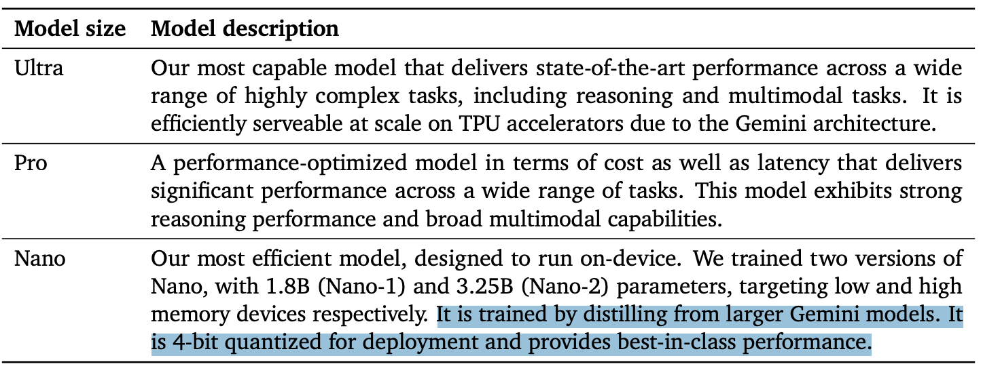
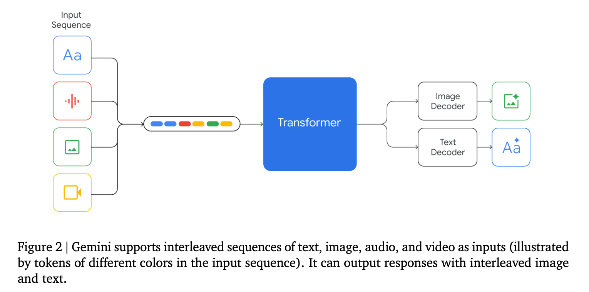

能力是跨图片、语音、视频和文本理解。

## 2 模型架构
基于 Transformer decoder 架构，做了架构优化来可以规模化训练，针对 TPU 做了推理优化。训练支持 32K token length，使用了高效的 attention 机制（比如 multi-query attention）。

是在宽广的语音、视觉输入，比如自然图片，图标(charts)，截图，PDFs 和视频上训练的，可以产出文字和图片。 visual encoding 部分是启发自自己的基模型工作：Flamingo, CoCa, PaLI。最重要的是从一开始就是多模态，可以原生地使用离散的图片 tokens 来输出图片

Flamingo: a visual language model for few-shot learning.
CoCa: Contrastive captioners are image-text foundation models
PaLI: A jointly-scaled multilingual language-image model
Zero-shot text-to-image generation (2021)
Scaling autoregressive models for content-rich text-to-image generation.

上面图很简略，但是说明了 Gemini 和其他多模态算法的不同：输入的序列可以是交错的文字、图片、语音、视频。

视频理解是通过把视频编码为长上下文窗口里的一系列帧来做的。视频帧或者图片可以是自然交错的，有文本或者语音作为模型输入。模型可以处理变长的输入分辨率，目的是在需要细粒度理解的任务上花费更多算力。这样可以让模型捕获那些**当声音被简单地映射到文本输入（比如，网站上的声音理解的 demo）**上会被丢失掉的名词。

对于 Pro 的模型，由于自建基础设施和学习算法的可扩展性，在利用大量资源后，我们可以在几周内就完成 pretraining

## 3 训练基础设施
使用 TPUv5e 和 TPUv4 来训练。

TPUv4 加速器部署在多个有 4096 个芯片的 “SuperPods” 上，每个连接在特定的光学交换机上，可以在10s左右自动重新配置 4x4x4 的芯片到任意的 3D 拓扑结构。对于 Gemini Ultra，我们决定保留少量的正方形来作为热备份和滚动维护。

TPU 通常主要是通过告诉的芯片间互联设备来通信的，但是 Gemini Ulta 的规模下，我们把多个数据中心里的 SuperPods 通过 Google 的集群内和集群间网络互联。网络延迟和带宽足够支撑常用的同步训练范式，在 superpod 内部进行(model parallelism,可见 TP 可以最大到 4096?)，而 superpods 之间进行数据并行

有 GSPMD 切分器，MegaScal XLA 编译器。

在如此大的规模上维护高的 goodput 几乎不可能用传统的间断性地 checkpoint 权重到可持久化的集群存储上去。我们使用了模型状态的内存冗余拷贝，遇到任何故障，就快速地从一个完整的模型副本里直接恢复。相比于 PaLM-2，这种方法的恢复时间更短（尽管使用了更大量的训练资源）。

我们遇到解决的问题之一是“Silent Data Corruption"。监管很少遇到，但是在 Gemini 的规模下，我们每一到两周就会遇到。我们完全确定性的基础设施，让我们可以快速定位到根源（包括硬件故障）。

## 4 训练集

Gemini 的训练集既是多模态的又是多语言的。

使用了 SentencePiece tokenizer，发现它在整个数据集上大量的采样，能提高词汇，在后续的模型性能上有提升。

训练最大模型的 tokens 数量是参照的 Hoffmann 的方法(2022)。小模型上会使用更多的tokens来提高在给定推理算力情况下的性能，类似 Touvron （2023a）里的方法

数据配比和权重是根据在小魔仙上的各种校准实验来得出的

Training compute-optimal large language models(2022)

Llama: Open and **efficient** foundation language models(2023a)

#### 5.1.2 能力上的趋势

主要是在六大不同能力上的50多个 benchmark 上做的测试：

1. 事实性(Factuality): 书籍里的检索(retrieval)，问答任务
2. 长上下文包括长文档的摘要总结，检索，问答
3. 数学、科学：数学解题，定理证明，科学测试
4. 推理：需要数学，科学和尝试的推理
5：多语言任务：翻译，摘要，推理

### 5.2 多模态
原生支持多模态（没太懂，为什么这么说）

#### 5.2.3 图片生成
Gemini可以原生输出图片，不需要依赖于中间的自然语言能避免模型表达图片时的瓶颈

### 6.4.2 Instruction Tuning
数据质量比数据数量要重要很多：Open foundation and fine-tuned chat models.

