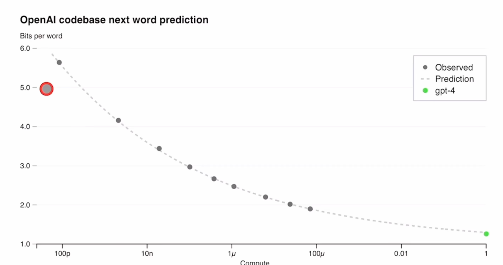

## 训练
模型的**能力似乎主要来自 pre-training 阶段** -- RLHF 不会提高考试的性能（如果不小心，还会降低它）。但是驾驭模型来自 post-training process(让模型能回答人类的问题，跟人类的行为方式、偏好对齐） -- 基模型甚至需要 prompt engineering 才能知道自己应该回答问题，否则不知道自己需要干什么。

斯坦福 ML Sys 课程里，请到了 Susan Zhang，他们3个月训 opt-175b 的过程，中间一共断了54次，有这么多次重启。
## Prerdictable scaling (预测的可扩展性）
GPT-4 项目很大的关键问题是：如何构建一个深度学习的 infra，能**准确地**扩大上去。主要原因是这么大的规模下，是不可能做大规模的模型调参的。首先要有大规模的机器，其次训练的稳定性又是问题：这么多机器并行训练，Loss 很容易跑飞。OpenAI 说研发了可以在多个尺度上进行预测的基建和优化方法。为了验证，在 GPT4 开始训练的时候，就可以准确预测 GPT-4 的最终 loss。这个最终 loss 是从比他小一万倍计算量的结果上外推出去的。

纵坐标可以理解为 Loss，横坐标是用了多少算力。能看到 openai 真的能做到准确预测出 GPT4 的 loss 曲线。而小一万倍的模型，应该就是 100u 这个模型了。这个技能点非常厉害，可以在同等算力下，用更快的速度试更多的方法。

还有一些能力是很难预测的。比如 Inverse Scaling Prize(就是专门给大模型找茬的比赛）
