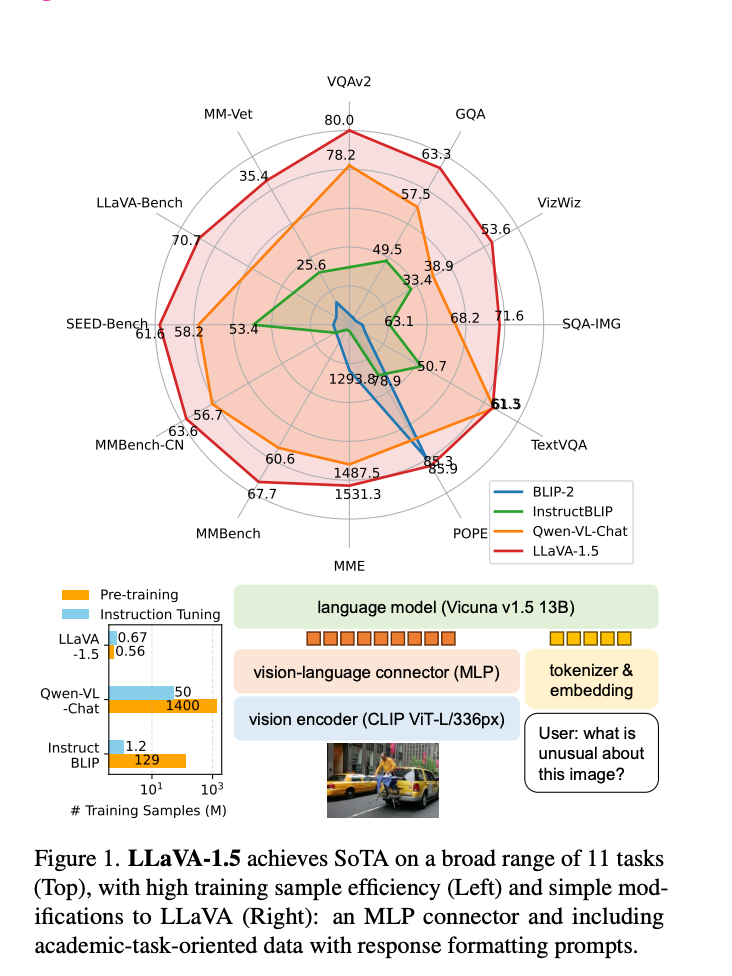

问题：
1. 从图里看 vl connector 出来的 embedding 比文本的 embedding 长度要长？而且 hiddensize 是不是也不同？

主要提高的地方：

1. 在大规模的数据上
2. 网络结构：使用更大的 13B 的 Vicuna v1.5，vl connector 使用 MLP 而非之前的单个 Linear。使用更大分辨率的输入：CLIP ViT-L/336px

## 4 讨论

### 计算开销
使用同样的 LCS-558K 的预训练数据集，保持训练 iter 和 batch size 大概和 LLaVA 的指令追随大概近似。于输入的图片分辨率提高到了 336px，训练 LLaVA-1.5 比 LLaVA 多2倍：6个小时的 pretraining，20小时的 visual instruction tuning，使用8个 A100。

### 限制
1. 使用了 full image patches。而 visual resamplers[2,9,24 InstructBLIP 里的 Qformer，Qwen-VL里的 Visual resampler] 可以减少 LLM 里 visual patches 的个数，但他们目前收敛速度没有 LLaVA 高，因为参数更大了。
2. 无法处理多图，因为缺少类似的 instruction following 数据，还有 context length 的限制
3. 尽管 LLaVA 1.5在跟随复杂指令上更强，但是解决问题的能力只在特定的领域里。需要 **能力更强的 LLM** 和更多复杂的、高质量的数据
