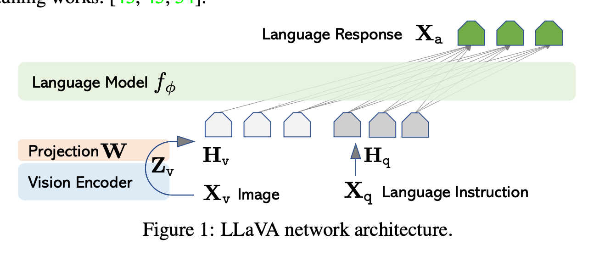

1. 在解决的是什么问题？开发通用的视觉语言助手，人类用语言做指令，机器用语言回复
2. 为何成功，标志/准是什么？
3. 在前人基础上的关键创新是什么？第一次把 instruction tuning 思路引入到 LMM 里，使得效果更好
4. 关键结果有哪些？把 GPT-4产出的视觉指令tuning data、模型和代码都开源了
5. 有哪些局限性？如何优化？
6. 这个工作可能有什么深远的影响？

## 摘要
使用机器生成的追随指令数据，能用来提高 LLM 在 zero-shoft 场景下新任务上的能力，但是这个思路很少在多模态领域里使用。在本文里，我们会第一次使用 GPT-4 纯语言模型来产生多模态的语言-图片指令追随数据。通过在这种数据上进行指令调优(instruction tuning)，我们做出了 LLaVA：Large Language and Vision Assistant，一个端到端训练过的大多模态模型，可以把视觉encoder和LLM结合起来做通用的视觉和语言理解。 Science QA 上 fine-tuned 之后，效果更佳。

## 1 介绍
AI 领域的核心抱负之一是开发一个通用的助手，可以高效跟随多模态的视觉-语言的指令，把人类的意图和众多实际任务对齐。

社区里出现了一批开发语言模型修正过的基础视觉模型，有在开放视觉理解上的很强能力，比如分类，检测，分割和标题提取，也有视觉生成和编辑。Computer Vision in the Wild 指开发可迁移的基座模型、系统来轻松适配到真实世界里的视觉任务上。这些工作的特点是使用一个大的视觉模型来独立解决每个任务，而任务的指令是隐式地被考虑在了模型设计里面。语言知识用来描述图片内容。这虽然让语言可以扮演一个更重要的把**视觉图像**映射到**语言语义**里面去

在另一方面，LLM 已经展示出了语言可以有更大的作用：一个通用的接口来作为通用的助手，各种任务的指令可以显示地放到语言里，指导端到端训练过的神经网络助手切换到任务上。LLaMA 是开源里能匹配上 GPT-3 的。Alpaca，Vicuna，GPT-4-LLM 都使用了各种机器产生的高质量指令追随数据样本来提高 LLM 对齐的能力。最重要的是这些工作都是只涉及到文本。

在本文里，我们提出了视觉的指令追随，第一次尝试把指令调优(instruct tuning)扩展到多模态空间。主要贡献：

* 多模态指令追随的数据。一个挑战是缺乏多模态指令追随的数据。我们提出了使用 ChatGPT、GPT-4 来把图片-文本对转换到合适的指令追随数据的方法
* 大的多模态模型：把开集视觉编码器和语言解码器 LLaMA 结合到一起，然后再上述产生的指令追随数据集上精调。
* 开源

## 2 相关工作

** 多模态指令跟随的 Agents** CV 里，已有工作可以分为两类：

1. 端到端训练的模型，在单个特定研究领域里
2. 搭建一个使用多种模型来处理的任务，比如 Visual ChatGPT，X-GPT 等

** 指令调优 ** Flamingo 是多模态领域里的 GPT-3 时刻，因为模型有很强的 zero-shot 任务迁移和上下文学习的能力。其他在文本对上训练的 LMM 包含 BLIP-2，FROMAGe，KOSMOS-1。PaLM-E 是给 embodied AI 使用的。基于开源的最好的 LLM LLaMA，OpenFlamingo 和 LLaMA-Adapter 是开源的让 LLaMA 可以使用图片输入的方法。虽然有很强的任务迁移能力，但是这些模型并不是显示地用 视觉指令数据调优过的。释一下，视觉指令调优和视觉prompt调优是不同的：前者聚焦在提高模型的指令追随能力，后者提高参数在模型适配时的效率（前者需要训练，后者不需要？）

## 3 GPT-assisted Visual Instruction Data Generation
具体怎么让 chatgpt 来生成？

社区里有很多多模态的数据比如图文对，CC 到 LAION。但是到了多模态的指令追随数据，就很少了，因为通过人力众包的过程比较耗时。受最近 GPT 模型的文本标注能力的启发，我们提出了使用 ChatGPT/GPT-4 多模态指令数据追随的收集方法，是基于目前的大量已有的图文对数据来做

论文里有个表一，是个例子。上面是给chatgpt的上下文，有两类：captions 和框，用来做 GPT 的提示词，下面是三种类型响应的例子：对话、详细的描述、复杂推理

**注意** ：视觉图片没有被 GPT 使用，放到例子里只是作为一个引用

## 4 Visual Instruction Tuning
LLaVA network arch:

如图可见，只是简单通过 一个 Projection 矩阵来把 Vision Encoder 里输出的 token 转换到语言的 embedding tokens Hq 上面。其他更复杂（计算开销更高）的方法有：gated cross-attention in Flamingo 和 Q-former in BLIP-2，其他视觉编码器如 SAM 提供对象级别的特性。未来工作里可以探索这些复杂架构

### 4.2 Training

两阶段：

**Stage1： 做 Vison Feature 到 LLM Feature 对齐的预训练阶段**

训练时，让视觉编码器和 LLM 都是冻结的，然后最大化可训练参数的似然估计（projection 的矩阵）。这样图片feature Hv 就会对齐到预训练好的 LLM word embedding。这个阶段可以理解为是给冻结的 LLM 训练一个兼容的视觉 tokenzier 器（visual tokenzier)

**Stage2 ： 端到端精调**

只把视觉编码器锁住，继续更新 projection layer和LLM。

为什么效果就比 BLIP-2，OpenFlamingo 效果好呢？
