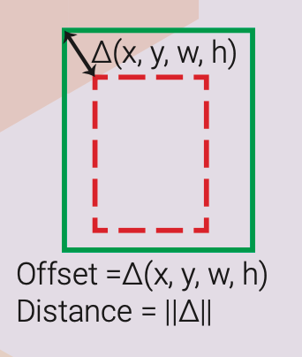
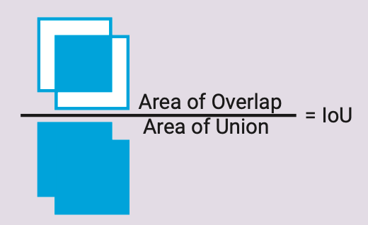
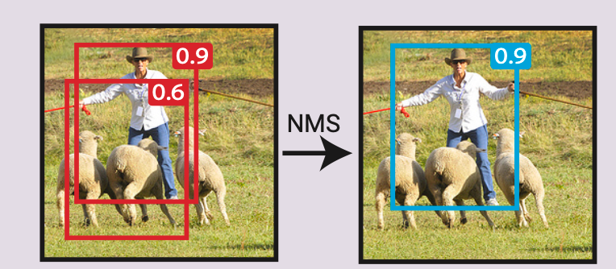
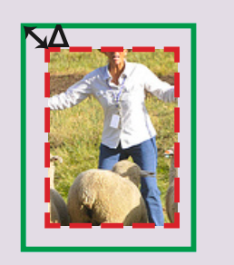

## 多尺度(Multiscale)
本质：对信号的不同粒度的采样，在不同尺度下我们可以观察到不同的特征

## Bounding Box Proposal(region of interest, region proposal, box proposal)

代表了输入图片里的矩形区域，可能包含了一个对象。产生这个proposal的方法: objectness, selective search, region proposal network (RPN). 一个 bouding box 一般伴随了一个置信度的分数，代表box里多大概率包含一个目标

两个框之间的差异通常用 L2 举例来表示。在计算之前可以把h和w用log来转换一下：

## Intersection over Union
IoU, Jaccard similarity:

用于衡量两个框之间的相似度：相交区域除以并集的区域

## Non Maximum Supression(NMS)
一个合并重叠的多个框(proposals or detections)的算法。任何显著与更高执行度的框重叠的框，都会被抑制。

## Bounding box regression(bounding box refinement: 微调)

通过查看输入区域，可以推断找出更好地符合内部目标的 bounding box，即使这个目标只有一部分在框里。下面的例子介绍了只通过查看目标的一部分来推断出实际框的情况。因此，一个回归器可以被训练成查看输入的一部分区域来预测输入区域(input region box，图里的红色)和ground truth box(绿色) 之间的offset。有了这个 offset，就可以调整 bbox 了。

bounding box regressor 可以是每个类别一个，也可以是类别无感的。通常bbox 回归器会跟一个 bbox 分类器(confidence scorer)来预估出box里的目标的执行度。这个分类器也是类别有感 or 无感的。如果没有定义 prior box，那么输入region box 就扮演 prior box的角色

## Prior box (default box, anchor box)

## Box Matching Strategy
不可能期望一个 bbox 回归器能预测离它的输入或者prior box区域(更常见)太远的bbox目标。因此，需要一个box 匹配策略来决定哪个 prior box 和一个 ground truth box 匹配。每个匹配是一个归回的训练样本。

可能的策略:

Multibox: 使用 有最高 IoU 的 prior box来匹配

SSD,FasterRCNN: 与任何ground trugh有高于0.5 IoU 的prior box

问题：bbox的输入或输出是什么？

## Hard negative example mining

对于每个 prior box, 有一个 bbox 分类器来预估里面有目标的概率。在 box matching之后，所有匹配的 prior box 都是这个分类器的正样本。其他所有prior box就是负样本。如果我们使用所有这些负样本，那就会有巨大的正负样本之间的不平衡。

可能的解决方案：

1. 随机挑一个负样本(FasterRCNN)
2. 挑一个分类器预测的类别错误最严重的(SSD)

最后目标是让正负样本的比例大概在3：1

