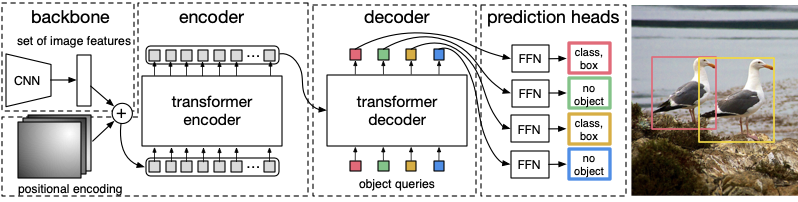

1. 在解决的是什么问题？想简化检测的流水线。与传统 cv 里的不同，检测里平常又复杂的手工的流水线，而 DETR 把检测当作一个直接的集合预测问题(direct set prediction problem). 包含一个基于集合的 global loss，通过二分匹配的唯一预测(unique predictions via bipartite matching)和transformer 的 encoder-decoder 架构来做。
2. 为何成功，标志/准是什么？
3. 在前人基础上的关键创新是什么？去掉了需要手工搞的一些组件，比如 non-maximum suppression 或者是 anchor 产生的过程（需要显示编码人对任务的先验经验）。使用了 set-based global loss。给定固定小集合的可学习对象请求，DETR 推理出对象和全局图片上下文之间的关系来直接并行输出最终集合。
4. 关键结果有哪些？
5. 有哪些局限性？如何优化？在小目标检测上效果不明显
6. 这个工作可能有什么深远的影响？

与传统 cv 里的不同，检测里平常又复杂的手工的流水线，而 DETR 把检测当作一个直接的集合预测问题(direct set prediction problem). 包含一个基于集合的 global loss，通过二分匹配的唯一预测(unique predictions via bipartite matching)和transformer 的 encoder-decoder 架构来做。给定一个固定的学到的对象query小集合,
DETR 推理出目标和全局图片上下文之间的关系来直接并行输出最后的预测集合。由于这个并行特性，DETR 非常快而且高效

## 介绍
目标检测的目标是预测出一堆 bounding box和对应的类别。现在的目标检测都是使用间接的方法来解决，通过在大量提议的集合(set of proposals)、anchro或者窗口中心，定义代理人回归(surrogate regression)和分类。速度会被后处理(去掉几乎重复的预测）严重拖慢
## Object Detection with DETR - a minimal implementation



从上图可以看出 DETR 架构非常简单，感谢 Transformer 的强大表达能力。主要有两块组件：

1. 卷积的 backbone - 我们使用  ResNet-50
2. Transformer: 使用默认的 nn.Transformer

使用的 80 COCO 输出类+1额外的"no object"类别。

DETR 使用标准的 ImageNet 归一化，输出 box 是相对于图片坐标，以 [xcenter, ycenter, w, h] 格式，x和y是bounding box的中心，w和h是宽度和高度。因为坐标相对于【0，1】之间的数值，所以为了可视化目的还需要转换回来

```
class DETRdemo(nn.Module):
  def __init__(self, num_classes, hidden_dim=256, nheads=8, num_encoder_layers=6, num_decoder_layers=6):
    super().__init__()
    self.backbone = resnet50()
    del self.backbone.fc
    self.conv = nn.Conv2d(2048, hidden_dim, 1) # down sampling?
    self.transformer = nn.Transformer(hidden_dim, nheads, num_encoder_layers, num_decoder_layers))

    self.linear_class = nn.Linear(hidden_dim, num_classes + 1) 
    self.linear_bbox = nn.Linear(hidden_dim, 4) # 输出就是4个坐标
    
    # output positional encodings (object queries)
    self.query_pos = nn.Parameter(torch.rand(100, hidden_dim))

    # spatial positional encodings
    # note that in baseline DETR we use sine positional encodings
    self.row_embed = nn.Parameter(torch.rand(50, hidden_dim // 2))
    self.col_embed = nn.Parameter(torch.rand(50, hidden_dim // 2))
    
  def forward(self, inputs):
    # propagate inputs through ResNet-50 up to avg-pool layer
    x = self.backbone.conv1(inputs)
    x = self.backbone.bn1(x)
    x = self.backbone.relu(x)
    x = self.backbone.maxpool(x)
    
    x = self.backbone.layer1(x)
    x = self.backbone.layer2(x)
    x = self.backbone.layer3(x)
    x = self.backbone.layer4(x)
    
    # convert from 2048 to 256 feature planes for the transformer
    h = self.conv(x) # convert from 2048 to 256 feature planes for the transformer
    
    # 下面有两部分 positional encodings
    # construct positional encodings
    # 即用到了 spatial positional encodings
    H, W = h.shape[-2:]
    pos = torch.cat([
        self.col_embed[:W].unsqueeze(0).repeat(H, 1, 1),
        self.row_embed[:H].unsqueeze(1).repeat(1, W, 1),
    ], dim=-1).flatten(0, 1).unsqueeze(1)
    
    # 即用到了 query_pos
    h = self.transformer(pos+0.1*h.flatten(2).permute(2, 0, 1), self.query_pos.unsqueeze(1)).transpose(0, 1)
    
    return {'pred_logits': self.linear_class(h), 
       'pred_boxes': self.linear_bbox(h).sigmoid() 
    }
```

## 问题
1. 没看懂那两个 positional encoding: spatial and output 

## 参考资料
1. [Detection TRansformers github](https://github.com/facebookresearch/detr)
2. [DETR minimal implementation](https://colab.research.google.com/github/facebookresearch/detr/blob/colab/notebooks/detr_demo.ipynb#scrollTo=GJhCp8y0-b-H)
