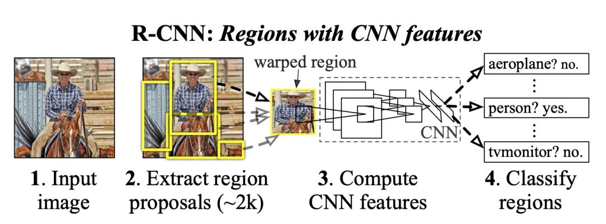

Rich feature hierarchies for accurate object detection and semantic segmentation

也可以当作： Region Based CNN

1. 在解决的是什么问题？能否把2012年 ImageNet 在分类上的巨大进展，泛化后用到 分类/分割任务里？在 object detection 领域提高检测准确率。
2. 为何成功，标志/准是什么？比去年的第一名，mAP 高了 30%
3. 在前人基础上的关键创新是什么？第一次把 CNN 引入到目标检测里，而且是用的 Selective search，而非滑动窗口。以前都是好几个模型混合到一起
4. 关键结果有哪些？1. 发现数据集比较稀缺的情况下，可以一反平常先用无监督预训练，再用有监督 fine-tuning 的方法，而是先用大的廉价数据集(ILSVRC 这个分类）做有监督预训练，然后用领域里小数据集（PASCAL）来做 fine-tuning ，提高了 mAP 8 个点。后来在分割上也成绩斐然。 2. 可以把 CNN 在分类上的上好发挥带入到检测里
5. 有哪些局限性？如何优化？ 速度比较慢，因为有 selective search，还有 nms，每个bb 都需要带入到 CNN 里求值。每个分类都有一个 SVM。而且由于是好几段网络结合起来的，所以要分别考虑优化和训练。
6. 这个工作可能有什么深远的影响？ 后续大家都把 CNN 拿过来用到检测上

关键词：Selective search, Supervised pre-training, 

## 局限
在分类之后，还需要后处理来改善bouding box，消除重复的检测。这样流水线很复杂，速度很慢，比较难优化
## 疑问：
1. Receptive field 是啥？
2. 回归问题是啥意思？

参考资料：

1. [Step by step - Understand the architecture of Region proposal network (R-CNN)](https://pallawi-ds.medium.com/step-by-step-understand-the-architecture-of-region-proposal-network-r-cnn-695a14a060a7)
2. [A guide to receptive field arithmetric for CNN](https://blog.mlreview.com/a-guide-to-receptive-field-arithmetic-for-convolutional-neural-networks-e0f514068807)
