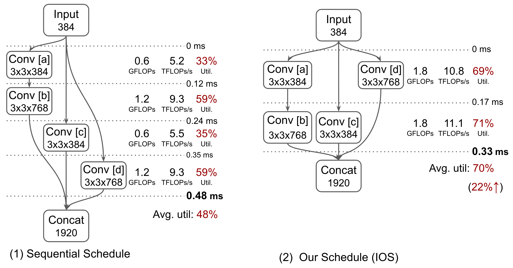

1. 在解决的是什么问题？新的网络结构在新的GPU上利用率不高的问题
2. 为何成功，标志/准是什么？
3. 在前人基础上的关键创新是什么？使用 dynamic programming 来解决问题，这样可以处理巨大的调度解空间，因为common sub-schedules among different schedules.
4. 关键结果有哪些？
5. 有哪些局限性？如何优化？
6. 这个工作可能有什么深远的影响？可以与TVM结合起来使用，tvm主要是提高算子内并行，加快算子粒度的速度。而这个方法是提高算子间的并行

https://github.com/mit-han-lab/inter-operator-scheduler

多分支的CNNs 使用更多小的Conv，放大了现在新的GPU上资源用不满的情况

有三种方法：

1. Intra-operator parallelism

op 内的并行主要由GPU和框架提供

2. Inter-operator scheduling

3. Graph transformation
算子融合能提高更大并发（一个更大算子而非两个小的、顺序的算子）并减少对GPU显存的访问次数。比如 MetaFlow、TASO

## 3. 用法
IOS 优化用户定义的计算图，在IOS的runtime里做推理:

下图展示了原来的一个顺序调度，如何切换为算子间并行的调度

tvm autotune做的是增大算子内并行，而 IOS 做的是增加算子间并行，所以两者是正交的

## 问题
1. 它github repo里写的 [Methodology](https://github.com/mit-han-lab/inter-operator-scheduler#1-methodology)，里面提到stage1 里是把 conv a 和b merge了一下，这个怎么做到呢？
2. pytorch，或者 cudnn，是怎么做的单个算子，比如 conv 内部的算子内并行呢？
3. 为什么大家的算子间并行，都是在推理上做？因为推理上一般 batchsize 较小，此时就比较需要算子间并行，来缩短推理的时间。而训练时batchsize比较大，此时适合算子内并行，而且这个事儿pytorch or cudnn 比较擅长
