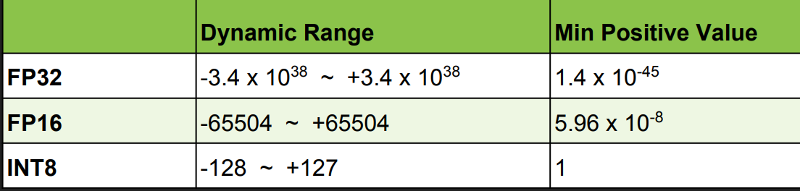

目标：把 FP32 的 CNN 转换到 int8 而没有明显的精度损失
为什么：INT8 的计算吞吐量更高，对内存要求更低
挑战：INT8 的精度和动态范围比fp32低很多
解决方案：当把训好的模型转为 int8 时把丢失的信息最小化
结果：方法实现在了 TensorRT 里，不需要任何额外 fine tuning 或者重新练

## Int 8 inference

int8的计算吞吐很高：

* 需要 sm_64+ (P4, P40, GTX 1080, Titan X)
* 四路 byte dot product，累加在一个32 bit 结果里。即一次能算4个 int8 的乘法

## Quantization

### "Relative Entropy" of two encodings

* int8 模型在编码和原始的fp32模型一样的信息
* 在此期间我们希望最小化信息的丢失
* 信息的损失可以由 Kullback-Leibler divergence (即 relative entropy 或者 信息的分叉(information divergence) 来衡量
P、Q：两个离散的可能性分布
KL_divergence(P,Q) := SUM(P[i]*log(P[i]/Q[i]), i)
* Intuition: LK divergence measures the amount of information lost when approximating a give encoding

## Calibration
解决方案：校准集

## Workflow in TensorRT

## Results

