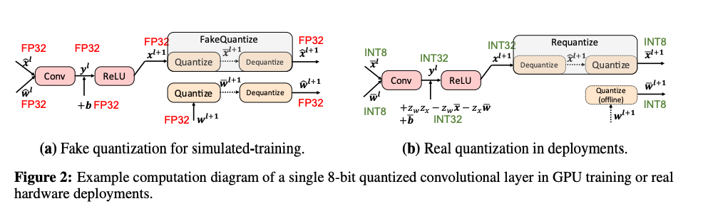
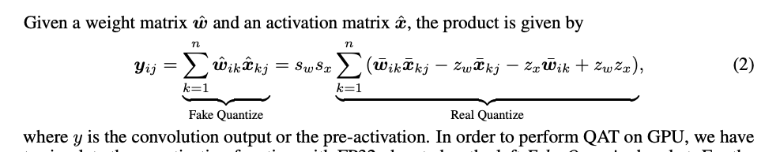

1. 在解决的是什么问题？验证了市面上量化算法的**可复现性**和**可部署性**，制定了一套 benchmark 的方法
2. 为何成功，标志/准是什么？讲清楚了学术界的有些量化算法为何无法部署，讲清楚了学术界和工业界的差异
3. 在前人基础上的关键创新是什么？定义了几个benchmark 的维度，发现了一些有趣的洞察
4. 关键结果有哪些？除了 benchmark，还讲了 BatchNorm 和图结构。设计了一套标准/唯一的 pipeline 来做测试可复现性
5. 有哪些局限性？如何优化？
6. 这个工作可能有什么深远的影响？后续学术界搞出来的量化方法，得考虑可部署性了

## 1. 介绍
大模型能在云上进行计算，然而这些模型部署到边缘侧设备时，由于资源受限、延迟、内存消耗和功率开销都受限，所以非常难。为了解决这些问题，为了加速边缘侧的推理，涌现了很多技术：模型量化，剪枝，网络蒸馏，轻量级网络设计，权重矩阵分解。

推理时量化目标是把（几乎）连续的 32 bit 浮点数映射到离散的低比特整数。这样让边缘侧的设备可以用整数运算单元来计算。

发现：

1. 训练的超参数可以很大程度影响量化网络的性能：所以有时候是训练技巧的元素，而非量化算法的作用
2. 学术研究的论文没有关注他们的算法是否能在实际的硬件上运行。所以报告的性能不可靠:
 a：硬件会把 BN 和 卷积合并到一起。但是大部分研究的论文都是保留 BN。
 b: 另外，论文里只关注卷积层的输入和权重参数的量化。而实际部署时整个计算图都应该被量化(这个是为啥？也不是绝对的吧)
 c: 算法鲁棒性：per-tensor量化的算法被应用到 per-channel 的量化上，会怎么样？而且实际要部署的硬件种类很多，咋办？

## 2. MQBench： Towards Reproducible Quantization
硬件感知的量化器(Hardware-aware Quantizer)：只本论文里只考虑对称量化，因为非对称量化（zero point 不是固定死到0的，可以调整）需要硬件支持。

量化器分为这几种：

1. 对称和非对称
2. Per-tensor ， Per-channel
3. FP32 scale 或 POT(Power of Two) scale

选了五款硬件的推理库：

1. NV 的 TensorRT (GPU)
2. HUAWEI ACL:(ASIC)
3. 高通的 SNPE(Mobile DSP)
4. TVM (ARM CPU)
5. FBGEMM (X86 CPU)

本文主要考虑了 QAT(Quantization-Aware Training)，附录C里展示了 PTQ(Post-Training Quantization)
### 算法：
主要有6个，其中有几个无法部署。这些本文称之为 学术 setting

### Network Architecture
使用 ResNet-18和 ResNet50，这是广泛使用的 baseline。也使用了 MobileNetV2 和 EfficientNet的 Lite 版本

### 位宽
8-bit PTQ 和 4-bit QAT。2bit QAT 无法收敛

### 2.1 训练 Pipeline 和超参数
之前论文里各自用的不同的预训练模型来初始化。而 MQBench 里是每个算法都是用预训练的模型。每个模型使用相同的预训练模型，消除初始化的差异

## 3. Towards Deployable Quantization
介绍了可部署的一些要求

### 3.1 Fake and Real Quantization
训练时在 GPU 上，所以为了在 GPU 上做 QAT，我们需要 Fake Quantization：用 FP32 来模拟量化过程。而实际推理时，只能使用整数算术运算，这个过程叫做 Real Quantize。如下图：

上述公式里 W, Zw, Zx 都是部署之前知道的

## TODO
1. 看看轻量网络设计：MobileNetV2\_Inverted\_Residuals
2. 看看网络蒸馏：A Gift from Knowledge Distillation: Fast Optimization, Network Minimization and Transfer Learning
3. cosine annealing policy 是啥？
4. Nesterov update
5. Google. Gemmlowp: building a quantization paradigm from first principles。搞清楚 Fake/Real Quantization中，那俩在部署前可以算出来的参数

## 问题：
1. 剪枝就是砍 channel 数量？
2. MQBench 是不是得提供硬件平台来实际部署，才能验证算法的可部署性？
3. 量化感知训练和训练后量化的主要差异？我们主要用哪个？为啥论文里主要谈 QAT？
4. 2.1 节：使用了 0.1 label smoothing in training to add regularization. 这是啥？
5. 上述公式里 W, Zw, Zx 都是部署之前知道的。这三个参数分别代表什么呢？
