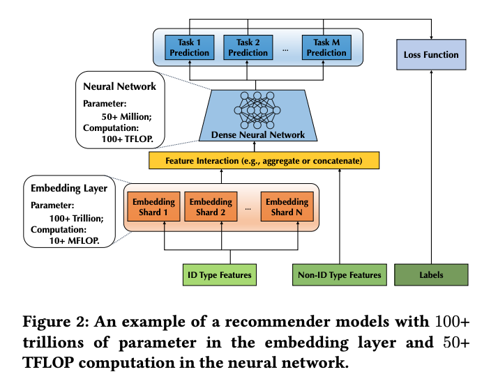

1. 在解决的是什么问题？ 推荐系统如何高效训练达到B甚至100T级别的模型
2. 为何成功，标志/准是什么？实现了第一个开源的可以训练100T级别推荐系统模型
3. 在前人基础上的关键创新是什么？算法和系统方面的协同优化来加速内存密集的 Embedding Layer 和计算密集的剩余神经网络层
4. 关键结果有哪些？可以扩展到100T
5. 有哪些局限性？如何优化？
6. 这个工作可能有什么深远的影响？

## 名词解释：
Embedding: 把高维向量转换到相对低纬度空间里去。embedding之后，一般会保留原来的近似语义：比如把相似的输入放的近一些。目的是让机器学习在大的输入，比如稀疏的向量空间上能做学习。

举例：

1. work2vec
2. 说在给用户推荐电影的场景下，把用户兴趣按照n个纬度进行划分，而这个embedding过程是可以根据数据来学习到，就跟人脸识别过程类似。

上述推荐电影的过，一些监督信号是已知的，比如用户看了某个电影两次。最后的目标是能最佳匹配用用户的实际观看情况。
也可以参考 [concepts#Embedding](../../concepts.md)
## 简介
推荐系统非常重要，一些任务比如CTR，BTR（buy through rate）预估被工业界应用广泛使用，给搜索引擎如 Google，Bing，Baidu等贡献十亿美金级别的收入。而且Netflix 上收看的80%的电影，YouTube 上点击的60%的
视频都是靠自动的推荐系统。Pinterest里40%的用户获得都是靠关联的推荐系统。Amazon 35% 的收入靠推荐系统。在快手，推荐系统让 3亿 DAU探索从几十亿候选集中筛选出的视频。

Google 2016 年 模型有1B，Facebook（2022） 有12T。模型容量的每一次条约都带来显著的质量提升，100T 已经在路上了。

增加的参数绝大部分来自于 embedding layer，它作用是把每个输入的 ID 类型的 feature(user ID, session ID) 映射为固定长度的低纬度 embedding vector。考虑到ID类型feature的十亿级别规模，以及feature cross的广泛使用，
embedding layer 通常主宰了参数空间，让这个组件是内存密集性。而另外一方面，这些低纬度 embedding vectors会和多样的非ID类型数据特征（image，audio，video，social network）等拼接到一起，来喂到越来越复杂的NN里(卷积，LSTM，multi-head attention)里
来预估。而且，实践中也会结合 multipe objectives 来并发地优化多个任务。这让 embedding layer 后续的网络是计算密集性的

传统方法是全局使用一样的训练算法（同步或者异步随机梯度下降）。在100T参数规模和上百台 worker 规模后，这种同质性让训练算法有严重问题：

1. 同步算法使用最新的梯度来更新模型，保证了模型精度。但是通信开销变得非常大，让训练低效、时间变长
2. 异步模式下有更好的硬件效率，但是机场会导致明显的精度下降

我们的问题：

1. 可否设计一个算法，来获得同步以及异步更新的优势，同时避免劣势，让推荐系统的规模达到100T？
2. 可否设计、优化、实现一个系统来高效支持这样的算法？
