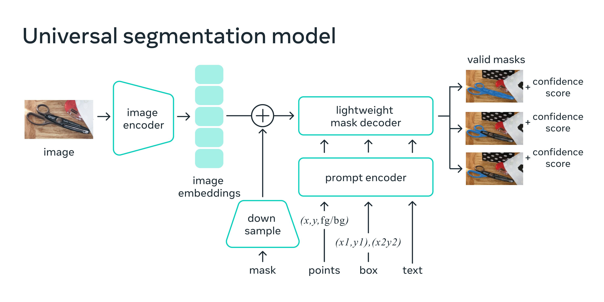

1. 在解决的是什么问题？
2. 为何成功，标志/准是什么？
3. 在前人基础上的关键创新是什么？
4. 关键结果有哪些？
5. 有哪些局限性？如何优化？
6. 这个工作可能有什么深远的影响？

SAM(Segment Anything Model) 是一个新的 AI 模型，可以从任意图片里，剪切出任意的对象，只需要点击一下。它是 promptable segmentation 系统，有着 zero-shot 的泛化能力，可以到不熟悉的
对象和图片上，而不需要额外的训练

## [常见问题](https://segment-anything.com/)

### 支持哪些类型的 prompts？
支持很多种 prompt 类型，prompt 用来指定图里的分割任务类型，而不需要额外的重新训练。

* 前景、背景的点
* Bounding box
* Mask : 是什么？
* Text prompts 要支持，但是能力却没有完全评估

### 模型结构是什么样的？
* 每个图片上只需要运行一次的 ViT-H image encoder，输出的是图片的 embedding
* 一个 prompt encoder，把输入的 prompts 比如点击或者矩形转换为 embeddings
* 轻量的基于 transformer 的 mask decoder，它根据图片的 embedding 和 prompt embeddings 来预测对象的mask

### 模型多大？
* image encoder ：632M 参数，即6.32亿
* prompt encoder 和 mask decoder 有4M参数，即4百万参数

### 推理需要多久？
* image encoder 需要 A100 上花费 ~0.15 秒
* prompt encoder 和 mask encoder 花费大约 50ms 的 CPU 在浏览器里 SIMD 执行的时间

### 模型如何产生 mask 标签？
模型不支持，只能预测出 mask，无法产生标签

### 训练需要花多久？
256 A100 上，需要3-5天
