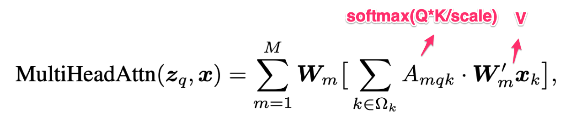
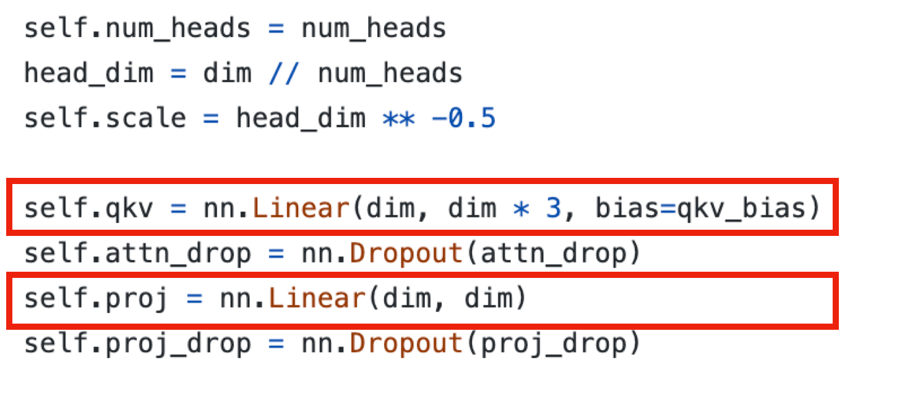
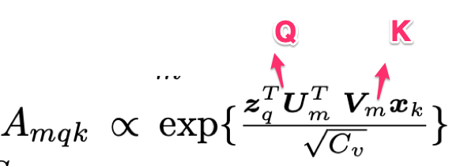
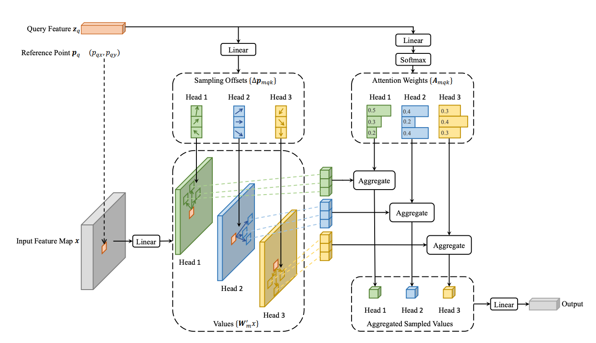
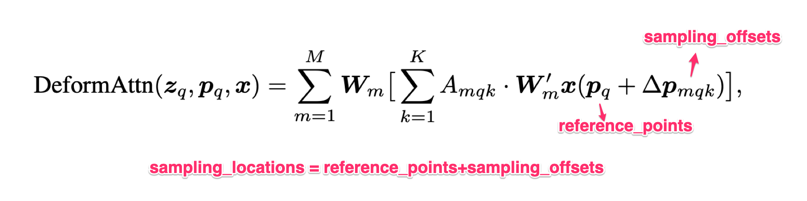
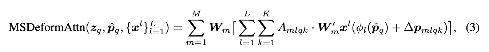

1. 在解决的是什么问题？self-attention 在 CV 里的应用--De(tection) TR(ansformer) 是 transformer 在 Detection 里的成功应用。但是它的收敛很慢（需要训很多 epoch）而且有限的feature spatial resolution。
2. 为何成功，标志/准是什么？比 DETR 的效果要好，尤其在小的物体上，而且epoch可以减小10倍。
3. 在前人基础上的关键创新是什么？ Attention 只考虑在给定的 reference 周围的一个采样结合上做
4. 关键结果有哪些？
5. 有哪些局限性？如何优化？
6. 这个工作可能有什么深远的影响？

## 1 介绍

DETR 的劣势：

1. DETR不仅需要很长的epoch 来训练，而且在小物体检测上表现不好，原因是小物体需要高分辨率，但 因为attention部分的计算复杂度是输入尺寸的平方，所以DETR处理大图片的效果不好
2. 和现代的目标检测相比，DETR 需要更多的epoch 来训练收敛。原因是attention 在处理图片features上很困难。例如，在初始化时，cross-attention 模块几乎是在全局feature上平均的注意力，但是到训练结束时，学出来的 attention map 非常稀疏，只聚焦在目标上。因此需要更长的训练时间来学习到attention map里的如此巨大的变化

## 2 相关工作

### 高效的 Attention 机制

大概分为三类：

#### 1 预定义好的 sparse attention patterns on keys

#### 2 learn data dependent sparse attention

比如提出的 Locality sensitive hashing (LSH) based attention, 会把 key和query一起hash到不同的桶里去

#### 3 使用 attention 里的 low-rank properity

给size而非 channel 维度加上 linear projection

Deformable attention，属于第二种

### 检测里多尺度的 Feature Representation

检测里的主要问题是如何高效表示各种不同大小(vastly different scales)的物体。一般都是通过多尺度来做。本文提出的多尺度 deformable attention，自然就可以聚合多尺度的 feature map，无须 feature pyramid 网络的支持（所以是简化了？）

Deformable conv，缺乏给元素之间关系建模的机制(element relation modeling mechanism)

## 3 Transformer 和 DETR

query: 输出句子里的一个单词

a set of keys: 输入句子里的一些单词

multi head attention 模块会 adaptively 把 key(指value?公式里的 Wm'*X) 里的内容根据 attention weights （衡量 query-key 键值对兼容性）（ softmax(q*\*)) 来做聚合。为了让模型聚焦在来自不同表达子空间(representation subspaces)和不同位置的内容，不同 attention head 是以可学习权重来线性聚合(Linear)的。即多头的结果会合并。

这里看到输入只有两个: zq和x(zq是啥呢？），分别是query 和输入的 表征(representation feature)，估计 Q=qm(zq)，K=km(x)?。上图中 Wm 和 Wm‘都是可学习的权重，如下图

而其中的attention weights是 Amqk，就是 softmax(Q*K/scale)：

上图中 Um和Vm都是可学习的权重，这俩都包含在上图第一个红框里了：qkv里

经过softmax 之后，Amqk就被搞成了概率的形式，他们的和是1。为了让 zq和xk表征里有位置信息，他俩通常会拼接或者加上 positional embeddings

在CV里，通常 Nq=Nk >> C(feature dimension) ，因为Nq和Nk就是像素，所以维度比C大？，所以计算复杂度是O(Nq\*Nk\*C)。因此复杂度是输入feature map大小的平方

### DETR

如下图，CNN backbone 抽取出的 feature map会经过一个标准的 Transformer(encoder-decoder)架构，来把输入变换为一个 object query 的集合。之后是3-layer的FFN来做bbox坐标的回归(b是4个元素，每个都在[0,1]里)。而linear层作为分类的结果

#### Encoder

DETR里的transformer encoder，它的 query 和 key 都是输入的feature map。这里encoder的计算复杂度是 O(H^2\*W^2\*C)，说明是跟feature map的大小成**平方关系**

对于 DETR 里的 decoder，输入包括两部分：

1. encoder输出的feature map
2. N个目标的请求(object queries)，以可学习的positional embeddings (比如 N=100）

#### Decoder

在decoder 里，有两类 attention 模块，即self和cross attention。

在 self-attention 里，object queries需要和其他人交互，来捕获之间的关系。query和key是都是 object queries。而 Nq=Nk=N,所以self attention的复杂度是O(2NC^2+N^2C)，即**与spatial size** 无关。复杂度在object queries可控下是可接受的。N一般就是100

在cross-attention 里， object queries从 feature map里抽取features（没太看懂）。query 元素是object queries，key 元素是 **encoder的输出** feature maps。因此 Nq = N(比如100），Nk=H\*W。因此 cross attention的复杂度是O(H\*W\*C^2+NHWC)，因此复杂度是输入feature map空间大小(spatial size)的**线性**。

## 4 方法

### 4.1 Deformable Transformers For End-to-End Object Detection

**Deformable Attention Module** 在图片 feature map上应用 transformer attention 时遇到的核心问题是它会访问所有可能的空间位置。为了解决这个问题，提出了 deformable attention 模块。受 deformable convolution 启发，它只关注在 reference point 周边的少量key sampling points，忽略 feature map 的大小。如下图2，通过给每个**query**应用少量**固定**的keys，收敛问题和feature空间分辨率问题就缓解了。

给定一个输入 feature map x(CHW)，让 q 是一个利用 content feature zq 就行的查询，pq是2-d的 reference point，那么 deformable attention feature 如下计算：

k 索引 sampled keys，K 是总共 sampled key 数量 (K << HW)。可见 attention weights 和 sampling offsets 都是与m,q,k 有关的，sampling offsets（可变卷积的核心？或者名字来源) 和 attention weights 都是通过 query feature zq 来linear projection 后得到的（见上图）。Amqk 这个 attention weights 依然是经过softmax成为概率的，和为1。而 sampling offsets 属于二维实数，由于 sampling locations 是分数的，所以在计算 x*sampling_locations 时使用 bilinear interpolation(与 Deformable Conv 类似)。实现时，zq被输入到一个 3MK channels 的linear 中去，前2MK channels(2d) 编码 sampling offsets，后一个 MK channels经过一个 softmax来获得 attention weights(1d)。 

Deformable Attention 与 attention 的差别：

1. 引入了 sampling locations，所以不是采样所有的V
2. q\*k -> q

Deformable attention 模块被设计为**把卷积 feature maps 当做 key elements 来处理**(所以只代替 decoder 里的 cross attention)。让 Nq 是 query lements 的长度，当 MK 相对较小，复杂度是 O(2NqC^2+min(HWC^2, NqKC^2))。当应用在 DETR encoder 里，Nq=HW，复杂度就是 O(HWC^2)，是feature size 的**线性复杂度**。当应用在 decoder 里的 cross attention 里时，Nq=N(N是object queries的数量=100)，复杂度是 O(NKC^2)，与**空间大小 HW无关**

所以看复杂度，deformable attention 应用在 encoder 里收益客观，从输入的平方复杂度变为线性复杂度

**多尺度 Deformable Attention Module**: 公式三和单个尺度的版本非常相似，除了从多尺度的feature map里，它采样的是 LK 个点而非单尺度下的K个点

当 L=1,K=1,Wm' 固定为一个 identity 矩阵时，就退化为 deformable conv。Deformable conv 是设计为处理单个尺度的输入，只聚焦在每个注意力头上采样一个点。而我们提出的多尺度 deformable attention在多尺度输入(L>1)下，查看的是多个(K > 1)采样点。提出的(多尺度) deformable attention 模块也可以看做是高效的 transformer attention：通过deformable sampling locations，一个预过滤的机制被引入。当采样的点遍历了所有可能的位置(K=?)，那就等价于transformer attention

## 问题

1. 4.1里提到的当采样的点遍历了所有可能位置，此时也不等价于 transformer attention吧？因为只是V等价，但是依然没有 Q*K 的过程

   