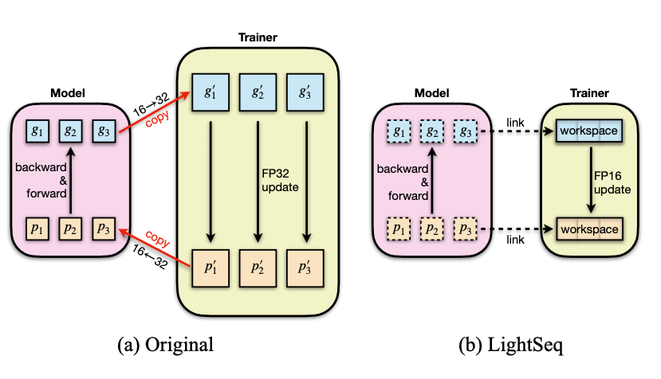

1. 在解决的是什么问题？ Transformer 的训练和推理加速
2. 为何成功，标志/准是什么？速度确实快，对收敛性没有影响
3. 在前人基础上的关键创新是什么？三方面，都是工程方面的 
4. 关键结果有哪些？
5. 有哪些局限性？如何优化？ 在大 seq_len 下，效果并不如 fasttransformer 好
6. 这个工作可能有什么深远的影响？

## 摘要
基于 Transformer 的模型，输入长度是不固定的。

DeepSpeed 只支持 Encoder，以及多卡之间的量化后的梯度更新。TVM 采用自动编译技术来根据特定模式搜索候选的优化集合，自动进行 op 的合并。然而，大部分自动工作只能支持固定输入，很难支持类似 Transformer 这样的自然语句类变长输入。而NV的 apex 通过量化来减少角度，从而提高计算和data I/O 的速度，所以会影响精度。

跟推理相比，训练过程中的反向传播和参数更新阶段需要更高的计算精度。

主要有三方面工作：

1. 特定 layer 的kernel 优化，增加 GPU 利用率
2. 细粒度混合精度训练器
3. 最强的策略来高效GPU 显存管理

LightSeq 支持了所有 Transformer 训练里涉及的阶段：

1. Embedding
2. Encoder
3. Decoder
4. Criterion
5. Trainer

## 背景

### 2.1 Transformer Models
存储中间状态的Tensor 是变长的，导致频繁分配和释放 GPU 显存。TurboTransformers 是使用 sequence-length 感知的分配器，来最大化共享非依赖性的 GPU 显存。这种分配依然是频繁的。LightSeq是提前分配最大长度的 GPU 显存，就不需要在训练过程中释放和分配了，所以速度很快

### 3.2 内存高效的混合精度训练器(trainer/optimizer)

如上图，左侧是传统的做法，模型里的梯度和权重需要在优化器里也保存一份，而且是32位的（因为梯度需要乘以学习率，会变得更小，担心会溢出）。而 ls 做法是让模型里的数据共享到优化器里，而在计算梯度更新时，使用强制转化为 fp32 的方式

这样既能减少显存带宽(fp16），还能避免在显存里冗余一份 fp32 的梯度和权重。这玩意是实现在 adam 里的？感觉不像，应该就是一个更新和计算的过程的通用操作，并不跟某个具体优化器绑定？

## 启发
1. softmax 里针对变长的seq 长度，使用了不同 block size，gride size，buffer size
2. 我们也可以用它的优化器，它显存占用少，速度快
3. 它是遍历一遍数据集，预估出上界，按照这个来申请零时内存空间
4. 它的优化主要并不是在矩阵乘上，而是在 LayerNorm，softmax 等上
5. 其中 3.2 节的高效混合精度优化器，相当于已经知道静态的网络结构(Encoder)了，然后对这个结构做优化
6. backward-propagation 和 参数更新需要相对更高的精度。为什么呢？
7. 针对 NLP transformer 里输入句子是变长的情况，计算过程中间值的内存要频繁申请。TurboTransformer 上的思路是搞一个长度感知的显存分配器，尽量让分配的显存可以复用

## 问题
1. 2.2 1 里为什么说参数更新阶段的时间显著缩短了？
2. 论文里提到的 trainer 是什么？是优化器
3. 3.1.1 softmax 里提到对常用输入大小做了kernels 的优化，这个在代码里哪里体现？难道就是那几个针对 softmax to_len 长度写的分支语句？
4. 3.1.2 里 Embedding Layer 在大部分 DL 任务里是为了获得一句话或一张图片在 distributed representation 。这个是什么意思？
5. 3.2 里 Mixed precision 优化器部分咋优化的？
