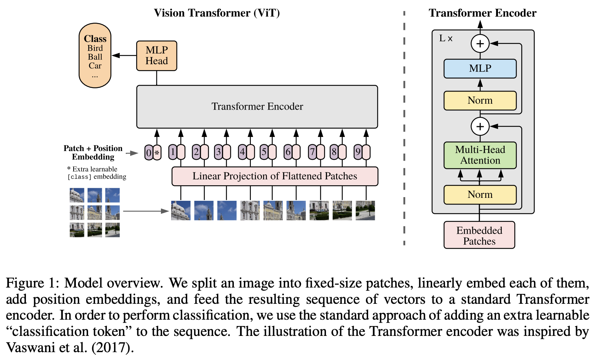

1. 在解决的是什么问题？想在 CV 领域里复制 transformer 的优势。
2. 为何成功，标志/准是什么？
3. 在前人基础上的关键创新是什么？发现来了之前 transformer 在 CV 里不好使的原因：没有使用大数据集。只用了 transformer，没有用 CNN 等，而且 transformer 的结构和 NLP 的几乎相同，没有特殊之处
4. 关键结果有哪些？在下游任务上表现良好
5. 有哪些局限性？如何优化？
6. 这个工作可能有什么深远的影响？

## TODO
1. 4实验里，看看三类任务上的效果
2. 看看 EQ 1-4 各自啥意思？

## 简介
当时 bert 的 sequence length 也就 512。而如何用 16x16的 patch，那么 224*224 分辨率下，整个图片也就 196 的 sequence length。

在图片上直接使用了标准的 transformer。为了这样做，把图片分成了 patches(16x16，跟题目契合：一个图片等价于一个个16x16的单词组成的句子），然后通过 linear embeddings 来把这些 patch 作为 Transformer 的输入。这样目的是让 transformer 迁移过来后，改动尽量小。图片分割之后的 patches，被当作跟 NLP 里 tokens(词组) 同样的用法。使用有监督的方式来在分类任务上进行训练

Transformer 缺乏一些归纳性的偏见(inductive biases，即先验的知识)，跟CNN相比，比如：

1. locality
2. 转换不变性: translation equivariance，平移不变性，即 f(g(x)) = g(f(x)) . f 是平移，g 是卷积。无论同样的物体在哪里，遇到相同的卷积核，输出都是一样的。

所以 transformer 没有上述归纳偏置，只能从数据里学，所以需要的数据量大。如果训练时的数据量不够大，就很难很好地泛化。

但是当在大数据集(14M-300M图片）上训练后，就胜出了。

之前也有同类工作，但是轴注意力和pixel 级别注意力太复杂了，不好利用硬件来加速。

## 3 Method
下面核心解决的问题是： transformer 是处理一维序列的，那怎么把图片这种二维信息搞成一维的序列？而且能保留一些位置信息



一张 224^2 的图片，假设 patch size 是 16x16，那 224^2/16^2 = 196 个 图像块，每个图像块是 `16*16*3` = 768 。所以是一张大图 224x224x3 -> 196x[16x16x3] 196张小图

而 Linear Projection of Flattented Patches 就是一个 embedding：[768, 768]，即输入是图片的纬度，输出是后面的 transformer 里 hidden size(768，可变） 的纬度

所以：输入的 embedded patches 是 (196+1)\*768，而通过最后的全连接层（768\*768） -> 197*768。而由于用的多头注意力，比如 base 里是12，那 q、k、v 就是 768/12 = 64 

而 embedded patches 里面其实是三步骤：
1. 图片的 Patch embedding ：是一个全连接层（为什么没用 embedding？）
2. + Position embedding。两者是相加的关系，而非 concat 。而这个位置编码下面有说明（图里是紫色和灰色相邻，实际运算是相加)
3. Learnable class(ViT 想解决分类问题） embedding：这个是在 seq 这个纬度上多了一个 token。不像上面是影响最后的 hidden size 那个纬度里的值

上图里 cls token 只有一个，即 shape 是 1x768。

图里的位置编码里的1，2 这些都只是一个序号，实际不会填入这些数字让模型来学习。而是一样有一个类似 embedding 的表格，每个的纬度是 768
## 实现

参考的 timm 中 vit 实现：

```
self.cls_token = nn.Parameter(torch.zeors(1, 1, embed_dim)) # 它是一个学来的参数
self.pos_embed = nn.Parameter(torch.zeros(1, num_patches+self.num_tokens, embed_dim)) # (1, 196+1, 768), 也是学来的参数，为了让 transformer 对位置有区分。否则输入的 patch 互换，结果是不变的，显然不行

# forward_features
x = self.patch_embed(x)
cls_token = self.cls_token.expand(x.shape[0], -1, -1) 
x = torch.cat((cls_token, x), dim=1)
x = x + self.pos_embed # 为啥是加呢？而不是乘积啥的？
x = self.pos_drop(x) # 这里及以上都是对图片做处理

x = self.blocks(x)
```

## 结论
未来：
0. 更大的模型
1. 探索自监督：只做了初始实验，发现效果相比有监督差（半年后提出了 ViT G）
2. 
## 问题
1. 题目中的 transformers for image recognition at scale. 这个 at scale 代表什么？是说问题规模，还是说较多数量的任务
2. 有其他效果较好的 CNN+ViT 的论文吗？
3. 自注意力和 transformer 是啥关系？
4. pretrain时，也只是大数据集在分类上训练吗？而 finetune 时有检测、分割等？
5. p1 里提到的：when trained on mid-sized datasets such as ImageNet without strong regularization, these models yield modest accuracies of . 这里 strong regularization 是什么意思？
6. Fig1 里，1，2 等格子隔壁的空白格子代表什么？
7. MLP 和 卷积是啥关系？

