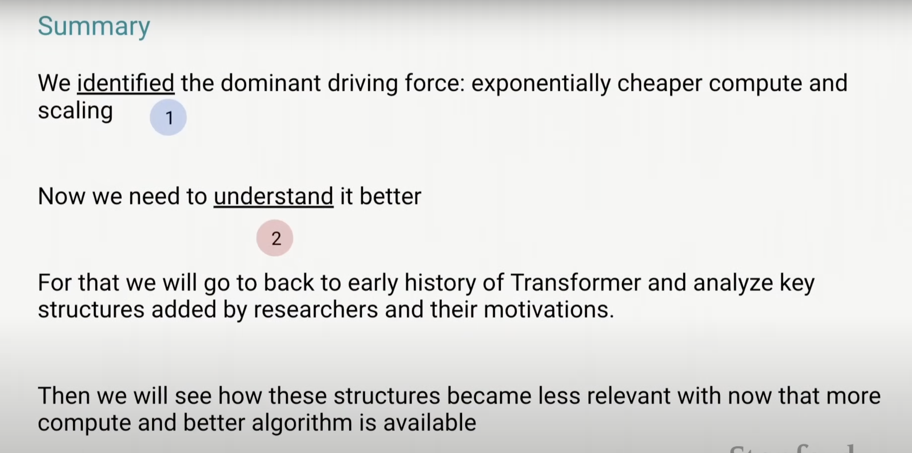

The job of AI researchers is to teach machines how to "think"

Bitter lesson: progress of AI in the past 70 years boils down to :
* Develop **progressively more general methods** with **weaker modeling assumptions**
* Add more data and computation (i.e. scale up)

The more structure, the less scalable the method is。但是如下图，可能在没见到效果之前，就先放弃了

