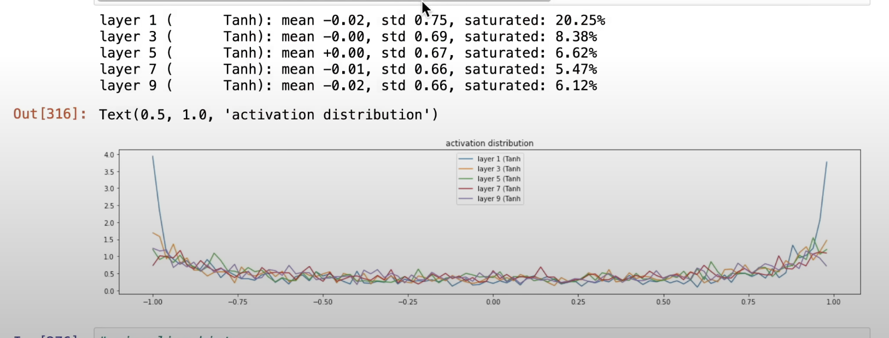

batch norm：我们希望激活值能够尽量符合均匀分布，所以就发明了 bn，它用来把数据进行居中处理。用到了 stdmean 和 stdvariance，而推理时也要用，所以就在训练过程中计算出它。由于 batchnorm 比较复杂，而且把不同的数据也耦合到了一起，所以很容易出 bug，尽量还是不要用它

还需要尽量防止激活值饱和(比如 tanh 函数里输入 t.abs() > 0.97):
 


通过修改初始化的过程，来达到让 tanh 的激活值分布更好（少一些饱和）


## 常见函数
### View
不改变底层存储的情况下，改变 tensor 的 shape，比如三维变二维，或者反之

```
embcat = emb.view(emb.shape[0], -1) # -1 指自动计算这个纬度（第二维）
embcat.view(emb.shape[0], N, C)  # view 的参数就是指定有哪几个纬度，各自是多少
```

### torch.mean
计算某个纬度上的均值
```
torch.mean(input_tensor, dim=None, keepdim=False) # dim=None 指计算所有元素的均值
hpreact.mean(0, keepdim=True) # 在 B 这个纬度上计算
hpreact.std(0, keepdim=True)
```